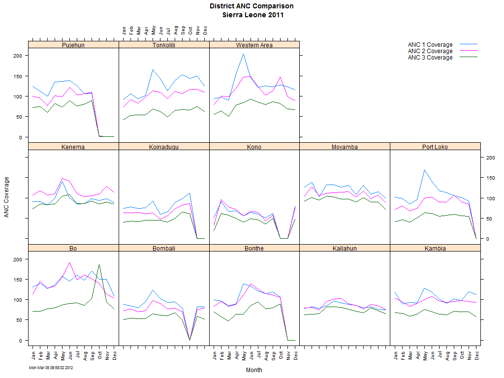
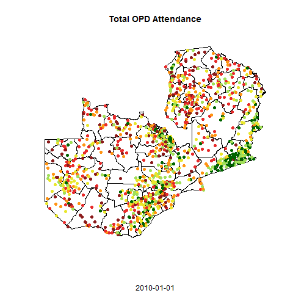
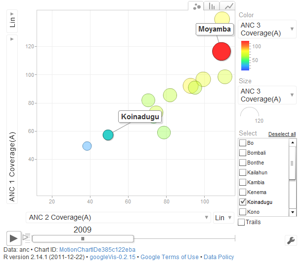
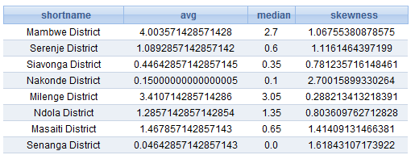

# DHIS2 and R integration

<!--DHIS2-SECTION-ID:rsetup-->

## Introduction

<!--DHIS2-SECTION-ID:rsetup_intro-->

R is freely available, open source statistical computing environment. R
refers to both the computer programming language, as well as the
software which can be used to create and run R scripts. There are
[numerous sources on the web](http://cran.r-project.org/) which describe
the extensive set of features of R.

R is a natural extension to DHIS2, as it provides powerful statistical
routines, data manipulation functions, and visualization tools. This
chapter will describe how to setup R and DHIS2 on the same server, and
will provide a simple example of how to retrieve data from the DHIS2
database into an R data frame and perform some basic calculations.

## Installing R

<!--DHIS2-SECTION-ID:rsetup_install-->

If you are installing R on the same server as DHIS, you should consider
using the Comprehensive R Archive Network (CRAN) to get the latest
distribution of R. All you need to do is to add the following like to
you `/etc/apt/source.list` file.

**deb \<your R mirror\>/bin/linux/ubuntu \<your Ubuntu distribution\>**

You will need to replace **\<your R mirror\>** with one from the list
available [here.](http://cran.r-project.org/mirrors.html) You will also
need to replace **\<your Ubuntu distribution\>** with the name of the
distribution you are using.

Once you have done this, invoke the following commands

    sudo apt-get update
    gpg --keyserver pgp.mit.edu --recv-keys 51716619E084DAB9
    gpg --armor --export 51716619E084DAB9 | apt-key add -
    sudo apt-get install r-base r-cran-dbi

At this point, you should have a functional R installation on your
machine.

Next, lets see if everything is working by simpling invoking `R` from
the command line.

    foo@bar:~$ R
    
    R version 2.14.1 (2011-12-22)
    Copyright (C) 2011 The R Foundation for Statistical Computing
    ISBN 3-900051-07-0
    Platform: i686-pc-linux-gnu (32-bit)
    
    R is free software and comes with ABSOLUTELY NO WARRANTY.
    You are welcome to redistribute it under certain conditions.
    Type 'license()' or 'licence()' for distribution details.
    
    R is a collaborative project with many contributors.
    Type 'contributors()' for more information and
    'citation()' on how to cite R or R packages in publications.
    
    Type 'demo()' for some demos, 'help()' for on-line help, or
    'help.start()' for an HTML browser interface to help.
    Type 'q()' to quit R.
    
    >

## Using ODBC to retrieve data from DHIS2 into R

<!--DHIS2-SECTION-ID:rsetup_odbc-->

In this example, we will use a system-wide ODBC connector which will be
used to retrieve data from the DHIS2 database. There are some
disadvantages with this approach, as ODBC is slower than other methods
and it does raise some security concerns by providing a system-wide
connector to all users. However, it is a convenient method to provide a
connection to multiple users. The use of the R package RODBC will be
used in this case. Other alternatives would be the use of the
[RPostgreSQL](http://dirk.eddelbuettel.com/code/rpostgresql.html)
package, which can interface directly through the PostgreSQL driver
described in the next section.

Assuming you have already installed R from the procedure in the previous
section. Invoke the following command to add the required libraries for
this example.

`apt-get install r-cran-rodbc r-cran-lattice odbc-postgresql`

Next, we need to configure the ODBC connection. Edit the file to suit
your local situation using the following template as a guide. Lets
create and edit a file called odbc.ini

    [dhis2]
    Description         = DHIS2 Database
    Driver              = /usr/lib/odbc/psqlodbcw.so
    Trace               = No
    TraceFile           = /tmp/sql.log
    Database            = dhis2
    Servername          = 127.0.0.1
    UserName            = postgres
    Password            = SomethingSecure
    Port                = 5432
    Protocol            = 9.0
    ReadOnly            = Yes
    RowVersioning       = No
    ShowSystemTables    = No
    ShowOidColumn       = No
    FakeOidIndex        = No
    ConnSettings        =
    Debug = 0

Finally, we need to install the ODBC connection with `odbcinst -i -d -f
odbc.ini`

From the R prompt, execute the following commands to connect to the
DHIS2 database.

    > library(RODBC)
    > channel<-odbcConnect("dhis2")#Note that the name must match the ODBC connector name
    > sqlTest<-c("SELECT dataelementid, name FROM dataelement LIMIT 10;")
    > sqlQuery(channel,sqlTest)
                                                                            name
    1   OPD First Attendances Under 5
    2   OPD First Attendances Over 5
    3   Deaths Anaemia Under 5 Years
    4   Deaths Clinical Case of Malaria Under 5 Years
    5   Inpatient discharges under 5
    6   Inpatient Under 5 Admissions
    7   Number ITNs
    8   OPD 1st Attendance Clinical Case of Malaria Under 5
    9  IP Discharge Clinical Case of Malaria Under 5 Years
    10 Deaths of malaria case provided with anti-malarial treatment 1 to 5 Years
    >

It seems R is able to retrieve data from the DHIS2 database.

As an illustrative example, lets say we have been asked to calculate the
relative percentage of OPD male and female under 5 attendances for the
last twelve months.First, lets create an SQL query which will provide us
the basic information which will be
    required.

    OPD<-sqlQuery(channel,"SELECT p.startdate, de.name as de, sum(dv.value::double precision)
     FROM datavalue dv
     INNER JOIN period p on dv.periodid = p.periodid
     INNER JOIN dataelement de on dv.dataelementid = de.dataelementid
     WHERE p.startdate >= '2011-01-01'
     and p.enddate <= '2011-12-31'
     and de.name ~*('Attendance OPD')
     GROUP BY p.startdate, de.name;")

We have stored the result of the SQL query in an R data frame called
"OPD". Lets take a look at what the data looks like.

``` 
> head(OPD)
   startdate                                 de    sum
1 2011-12-01   Attendance OPD <12 months female  42557
2 2011-02-01   Attendance OPD <12 months female 127485
3 2011-01-01   Attendance OPD 12-59 months male 200734
4 2011-04-01   Attendance OPD 12-59 months male 222649
5 2011-06-01   Attendance OPD 12-59 months male 168896
6 2011-03-01 Attendance OPD 12-59 months female 268141
> unique(OPD$de)
[1] Attendance OPD <12 months female   Attendance OPD 12-59 months male  
[3] Attendance OPD 12-59 months female Attendance OPD >5 years male      
[5] Attendance OPD <12 months male     Attendance OPD >5 years female    
6 Levels: Attendance OPD 12-59 months female ... Attendance OPD >5 years male
> 
          
```

We can see that we need to aggregate the two age groups (\< 12 months
and 12-59 months) into a single variable, based on the gender. Lets
reshape the data into a crosstabulated table to make this easier to
visualize and calculate the summaries.

    >OPD.ct<-cast(OPD,startdate ~ de) 
    >colnames(OPD.ct)
    [1] "startdate"                          "Attendance OPD 12-59 months female"
    [3] "Attendance OPD 12-59 months male"   "Attendance OPD <12 months female"  
    [5] "Attendance OPD <12 months male"     "Attendance OPD >5 years female"    
    [7] "Attendance OPD >5 years male" 

We have reshaped the data so that the data elements are individual
columns. It looks like we need to aggregate the second and fourth
columns together to get the under 5 female attendance, and then the
third and fifth columns to get the male under 5 attendance.After this,
lets subset the data into a new data frame just to get the required
information and display the results.

    > OPD.ct$OPDUnder5Female<-OPD.ct[,2]+OPD.ct[,4]#Females
    > OPD.ct$OPDUnder5Male<-OPD.ct[,3]+OPD.ct[,5]#males
    > OPD.ct.summary<-OPD.ct[,c(1,8,9)]#new summary data frame
    >OPD.ct.summary$FemalePercent<-
    OPD.ct.summary$OPDUnder5Female/
    (OPD.ct.summary$OPDUnder5Female + OPD.ct.summary$OPDUnder5Male)*100#Females
    >OPD.ct.summary$MalePercent<-
    OPD.ct.summary$OPDUnder5Male/
    (OPD.ct.summary$OPDUnder5Female + OPD.ct.summary$OPDUnder5Male)*100#Males 

Of course, this could be accomplished much more elegantly, but for the
purpose of the illustration, this code is rather verbose.Finally, lets
display the required information.

    > OPD.ct.summary[,c(1,4,5)]
        startdate FemalePercent MalePercent
    1  2011-01-01      51.13360    48.86640
    2  2011-02-01      51.49154    48.50846
    3  2011-03-01      51.55651    48.44349
    4  2011-04-01      51.19867    48.80133
    5  2011-05-01      51.29902    48.70098
    6  2011-06-01      51.66519    48.33481
    7  2011-07-01      51.68762    48.31238
    8  2011-08-01      51.49467    48.50533
    9  2011-09-01      51.20394    48.79606
    10 2011-10-01      51.34465    48.65535
    11 2011-11-01      51.42526    48.57474
    12 2011-12-01      50.68933    49.31067

We can see that the male and female attendances are very similar for
each month of the year, with seemingly higher male attendance relative
to female attendance in the month of December.

In this example, we showed how to retrieve data from the DHIS2 database
and manipulate in with some simple R commands. The basic pattern for
using DHIS2 and R together, will be the retrieval of data from the DHIS2
database with an SQL query into an R data frame, followed by whatever
routines (statistical analysis, plotting, etc) which may be required.

## Using R with MyDatamart

<!--DHIS2-SECTION-ID:rsetup_mydatamart-->

MyDatamart provides useful interface to the DHIS2 database by making a
local copy of the database available on a users desktop. This means that
the user does not need direct access to the database and the data can be
worked with offline on the users local machine. In this example, we will
have used the [demo database](http://apps.dhis2.org/demo). Data was
downloaded at the district level for Jan 2011-Dec 201l. Consult the
MyDatamart section in this manual for more detailed information.

First, lets load some required R packages. If you do not have these
packages already installed in your version of R, you will need to do so
before proceeding with the example.

    library("DBI")
    library("RSQLite")
    library("lattice")
    library("latticeExtra")

Next, we are going to connect to the local copy of the MyDatamart
database. In this case, it was located at C:\\dhis2\\sl.dmart.

    dbPath<-"C:\\dhis2\\sl.dmart"
    drv<-dbDriver("SQLite")
    db<-dbConnect(drv,dbPath)

Let suppose we have been asked to compare ANC 1, 2, 3 coverage rates for
each district for 2011. We can define an SQL query to retrieve data from
the MyDatamart database into an R data frame as follows.

    #An SQL query which will retreive all indicators 
    #at OU2 le
    sql<-"SELECT * FROM pivotsource_indicator_ou2_m 
    WHERE year = '2011'"
    #Execute the query into a new result set
    rs<-dbSendQuery(db,sql)
    #Put the entire result set into a new data frame
    Inds<-fetch(rs,n=-1)
    #Clean up a bit
    dbClearResult(rs)
    dbDisconnect(db)

We used one of the pre-existing Pivot Source queries in the database to
get all of the indicator values. Of course, we could have retrieved only
the ANC indicators, but we did not exactly know how the data was
structured, or how the columns were named, so lets take a closer look.

    #Get the name of the columns
    colnames(Inds)
    #output not shown for brevity
    levels(as.factor(Inds$indshort)) 

We see from the `colnames` command that there is an column called
"indshort" which looks like it contains some indicator names. We can see
the names using the second command. After we have determined which ones
we need (ANC 1, 2, and 3), lets further subset the data so that we only
have these.

    #Subset the data for ANC
    ANC<-Inds[grep("ANC (1|2|3) Coverage",as.factor(Inds$indshort)),]

We just used R's grep function to retrieve all the rows and columns of
the Inds data frame which matched the regular expression "ANC (1|2|3)
Coverage" and put this into a new data frame called "ANC".

By looking at the data with the `str(ANC)` command, we will notice that
the time periods are not ordered correctly, so lets fix this before we
try and create a plot of the data.

    #Lets reorder the months
    MonthOrder<-c('Jan','Feb','Mar','Apr',
    'May','Jun','Jul','Aug','Sep','Oct','Nov','Dec')
    ANC$month<-factor(ANC$month,levels=MonthOrder)

Next, we need to actually calculate the indicator value from the
numerator, factor and denominator.

    #Calculate the indicator value
    ANC$value<-ANC$numxfactor/ANC$denominatorvalue

Finally, lets create a simple trellis plot which compares ANC 1, 2, 3
for each district by month and save it to our local working directory in
a file called "District\_ANC.png".

    png(filename="District_ANC.png",width=1024,height=768)
    plot.new()
     xyplot(value ~ month | ou2, data=ANC, type="a", main="District ANC Comparison Sierra Leone 2011",
     groups=indshort,xlab="Month",ylab="ANC Coverage",
     scales = list(x = list(rot=90)),
     key = simpleKey(levels(factor(ANC$indshort)),
     points=FALSE,lines=TRUE,corner=c(1,1)))
     mtext(date(), side=1, line=3, outer=F, adj=0, cex=0.7)
    dev.off()

The results of which are displayed below.



## Mapping with R and PostgreSQL

<!--DHIS2-SECTION-ID:rsetup_maps-->

A somewhat more extended example, will use the RPostgreSQL library and
several other libraries to produce a map from the coordinates stored in
the database. We will define a few helper functions to provide a layer
of abstraction, which will make the R code more reusable.

``` 
#load some dependent libraries
 library(maps)
 library(maptools)
 library(ColorBrewer)
 library(ClassInt)
 library(RPostgreSQL)

#Define some helper functions
 
#Returns a dataframe from the connection for a valid statement
dfFromSQL<-function (con,sql){
    rs<-dbSendQuery(con,sql)
    result<-fetch(rs,n=-1)
    return(result)
}
#Returns a list of latitudes and
 longitudes from the orgunit table
dhisGetFacilityCoordinates<- function(con,levelLimit=4) {
sqlCoords<-paste("SELECT ou.organisationunitid, ou.name,
substring(ou.coordinates from E'(?=,?)-[0-9]+\\.[0-9]+')::double precision as latitude,
substring(ou.coordinates from E'[0-9\\.]+'):double precision as
 longitude FROM organisationunit ou where ou.organisationunitid
 in (SELECT DISTINCT idlevel",levelLimit, " from _orgunitstructure)
 and ou.featuretype = 'Point'
 ;",sep="")
 result<-dfFromSQL(con,sqlCoords)
 return(result)
 }

#Gets a dataframe of IndicatorValues,
# provided the name of the indicator,
# startdate, periodtype and level
dhisGetAggregatedIndicatorValues<-function(con,
indicatorName,
startdate,
periodtype="Yearly",
level=4)
{
  sql<-paste("SELECT organisationunitid,dv.value FROM aggregatedindicatorvalue dv
where dv.indicatorid  =
(SELECT indicatorid from indicator where name = \'",indicatorName,"\') and dv.level
 =", level,"and
 dv.periodid  = 
(SELECT periodid from period where 
startdate = \'",startdate,"\'
and periodtypeid = 
(SELECT periodtypeid from periodtype
 where name = \'",periodtype,"\'));",sep="")
   result<-dfFromSQL(con,sql)
 return(result)
 }

#Main function which handles the plotting.
#con is the database connection
#IndicatorName is the name of the Indicator
#StartDate is the startdate
#baselayer is the baselayer
plotIndicator<-function(con,
IndicatorName,
StartDate,
periodtype="Yearly",
level=4,baselayer) 
{
#First, get the desired indicator data
myDF<-dhisGetAggregatedIndicatorValues(con,
IndicatorName,StartDate,periodtype,level)
#Next, get the coordinates
coords<-dhisGetFacilityCoordinates(con,level)
#Merge the indicataors with the coordinates data frame
myDF<-merge(myDF,coords)
#We need to cast the new data fram to a spatial data
#frame in order to utilize plot
myDF<-SpatialPointsDataFrame(myDF[,
c("longitude","latitude")],myDF)
#Define some color scales
IndColors<-c("firebrick4","firebrick1","gold"
,"darkolivegreen1","darkgreen")
#Define the class breaks. In this case, we are going
#to use 6 quantiles
class<-classIntervals(myDF$value,n=6,style="quantile"
,pal=IndColors)
#Define a vector for the color codes to be used for the
#coloring of points by class
colCode<-findColours(class,IndColors)
#Go ahead and make the plot
myPlot<-plot.new()
#First, plot the base layer
plot(baselayer)
#Next, add the points data frame
points(myDF,col=colCode,pch=19)
#Add the indicator name to the title of the map
title(main=IndicatorName,sub=StartDate)
#Finally, return the plot from the function
return(myPlot) }

```

Up until this point, we have defined a few functions to help us make a
map. We need to get the coordinates stored in the database and merge
these with the indicator which we plan to map. We then retrieve the data
from the aggregated indicator table, create a special type of data frame
(SpatialPointsDataFrame), apply some styling to this, and then create
the plot.

    #Now we define the actual thing to do
    #Lets get a connection to the database
    con <- dbConnect(PostgreSQL(), user= "dhis", password="SomethingSecure", dbname="dhis")
    #Define the name of the indicator to plot
    MyIndicatorName<-"Total OPD Attendance"
    MyPeriodType<-"Yearly"
    #This should match the level where coordinates are stored
    MyLevel<-4
    #Given the startdate and period type, it is enough
    #to determine the period
    MyStartDate<-"2010-01-01"
    #Get some Some Zambia district data from GADM
    #This is going to be used as the background layer
    con <- url("http://www.filefactory.com/file/c2a3898/n/ZMB_adm2_RData")
    print(load(con))#saved as gadm object
    #Make the map
    plotIndicator(con,MyIndicatorName,MyStartDate,MyPeriodType,MyLevel,gadm)

The results of the plotIndicator function are shown below.



In this example, we showed how to use the RPostgreSQL library and other
helper libraries(Maptools, ColorBrewer) to create a simple map from the
DHIS2 data mart.

## Using R, DHIS2 and the Google Visualization API

<!--DHIS2-SECTION-ID:rsetup_google_visualization_api-->

Google's Visualization API provides a very rich set of tools for the
visualization of multi-dimensional data. In this simple example, we will
show how to create a simple motion chart with the Google Visualization
API using the "googleVis" R package. Full information on the package can
be found [here.](http://code.google.com/p/google-motion-charts-with-r/).
The basic principle, as with the other examples, is to get some data
from the DHIS2 database, and bring it into R, perform some minor
alterations on the data to make it easier to work with, and then create
the chart. In this case, we will compare ANC1,2,3 data over time and see
how they are related with a motion chart.

    #Load some libraries
    library(RPostgreSQL)
    library(googleVis)
    library(reshape)
    #A small helper function to get a data frame from some SQL
    dfFromSQL<-function (con,sql){
        rs<-dbSendQuery(con,sql)
        result<-fetch(rs,n=-1)
        return(result)
    }
    
    #Get a database connection
    user<-"postgres"
    password<-"postgres"
    host<-"127.0.0.1"
    port<-"5432"
    dbname<-"dhis2_demo"
    con <- dbConnect(PostgreSQL(), user= user,
    password=password,host=host, port=port,dbname=dbname)
    #Let's retrieve some ANC data from the demo database
    sql<-"SELECT ou.shortname as province,
    i.shortname as indicator,
    extract(year from p.startdate) as year,
     a.value
    FROM aggregatedindicatorvalue a
    INNER JOIN  organisationunit ou on a.organisationunitid = ou.organisationunitid
    INNER JOIN indicator i on a.indicatorid = i.indicatorid
    INNER JOIN period p on a.periodid = p.periodid
    WHERE a.indicatorid IN
    (SELECT DISTINCT indicatorid from indicator where shortname ~*('ANC [123] Coverage'))
    AND a.organisationunitid IN
     (SELECT DISTINCT idlevel2 from _orgunitstructure where idlevel2 is not null)
    AND a.periodtypeid = (SELECT DISTINCT periodtypeid from periodtype where name = 'Yearly')"
    #Store this in a data frame
    anc<-dfFromSQL(con,sql)
    #Change these some columns to factors so that the reshape will work more easily
    
    anc$province<-as.factor(anc$province)
    anc$indicator<-as.factor(anc$indicator)
    #We need the time variable as numeric
    anc$year<-as.numeric(as.character(anc$year))
    #Need to cast the table into a slightly different format
    anc<-cast(anc,province + year ~ indicator)
    #Now, create the motion chart and plot it
    M<-gvisMotionChart(anc,idvar="province",timevar="year")
    plot(M)

The resulting graph is displayed below.




Using packages like [brew](http://cran.r-project.org/package=brew) or
[Rapache](http://rapache.net), these types of graphs could be easily
integrated into external web sites. A fully functional version of the
chart shown above can be accessed
[here.](http://dhis2.net/R/google-motion-chart.html)

## Using PL/R with DHIS2

<!--DHIS2-SECTION-ID:rsetup_plr-->

The procedural language for R is an extension to the core of PostgreSQL
which allows data to be passed from the database to R, where
calculations in R can be performed. The data can then be passed back to
the database for further processing.. In this example, we will create a
function to calculate some summary statistics which do not exist by
default in SQL by using R. We will then create an SQL View in DHIS2 to
display the results. The advantage of utilizing R in this context is
that we do not need to write any significant amount of code to return
these summary statistics, but simply utilize the built-in functions of R
to do the work for us.

First, you will need to install [PL/R](http://www.joeconway.com/plr/),
which is described in detail
[here.](http://www.joeconway.com/plr/doc/plr-install.html). Following
the example from the PL/R site, we will create some custom aggregate
functions as detailed
[here.](http://www.joeconway.com/plr/doc/plr-aggregate-funcs.html) We
will create two functions, to return the median and the skewness of a
range of values.

    CREATE OR REPLACE FUNCTION r_median(_float8) returns float as '
      median(arg1)
    ' language 'plr';
    
    CREATE AGGREGATE median (
      sfunc = plr_array_accum,
      basetype = float8,
      stype = _float8,
      finalfunc = r_median
    );
    
    CREATE OR REPLACE FUNCTION r_skewness(_float8) returns float as '
      require(e1071)
      skewness(arg1)
    ' language 'plr';
    
    CREATE AGGREGATE skewness (
      sfunc = plr_array_accum,
      basetype = float8,
      stype = _float8,
      finalfunc = r_skewness
    );

Next, we will define an SQL query which will be used to retrieve the two
new aggregate functions (median and skewness) which will be calculated
using R. In this case, we will just get a single indicator from the data
mart at the district level and calculate the summary values based on the
name of the district which the values belong to. This query is very
specific, but could be easily adapted to your own database.

    SELECT  ou.shortname,avg(dv.value),
    median(dv.value),skewness(dv.value) FROM aggregatedindicatorvalue dv
    INNER JOIN period p on p.periodid = dv.periodid
    INNER JOIN organisationunit ou on 
    dv.organisationunitid = ou.organisationunitid
    WHERE dv.indicatorid = 112670
    AND dv.level = 3
    AND dv.periodtypeid = 3
    AND p.startdate >='2009-01-01'
    GROUP BY ou.shortname;

We can then save this query in the form of SQL View in DHIS2. A clipped
version of the results are shown below.




In this simple example, we have shown how to use PL/R with the DHIS2
database and web interface to display some summary statistics using R to
perform the calculations.

## Using this DHIS2 Web API with R

<!--DHIS2-SECTION-ID:rsetup_web_api-->

DHIS2 has a powerful Web API which can be used to integrate applications
together. In this section, we will illustrate a few trivial examples of
the use of the Web API, and how we can retrieve data and metadata for
use in R. The Web API uses basic HTTP authentication (as described in
the Web API section of this document). Using two R packages "RCurl" and
"XML", we will be able to work with the output of the API in R. In the
first example, we will get some metadata from the database.

    #We are going to need these two libraries
    require(RCurl)
    require(XML)
    #This is a URL endpoint for a report table which we can 
    #get from the WebAPI. 
    
    url<-"https://apps.dhis2.org/dev/api/reportTables/KJFbpIymTAo/data.csv"
    #Lets get the response and we do not need the headers
    #This site has some issues with its SSL certificate
    #so lets not verify it.
    response<-getURL(url,userpwd="admin:district"
    ,httpauth = 1L, header=FALSE,ssl.verifypeer = FALSE)
    #Unquote the data
    data<-noquote(response)
    #here is the data.
    mydata<-read.table(textConnection(data),sep=",",header=T)
    head(mydata)

Here, we have shown how to get some aggregate data from the DHIS2 demo
database using the DHIS2's Web API.

In the next code example, we will retrieve some metadata, namely a list
of data elements and their unique identifiers.

    #Get the list of data elements. Turn off paging and links
    #This site has some issues with its SSL certificate
    #so lets not verify it.
    url<-"https://apps.dhis2.org/dev/api/dataElements.xml?
    paging=false&links=false"
    response<-getURL(url,userpwd="admin:district",
    httpauth = 1L, header=FALSE,ssl.verifypeer = FALSE)
    #We ned to parse the result
    bri<-xmlParse(response)
    #And get the root
    r<-xmlRoot(bri)
    #Parse out what we need explicitly, in this case from the first node
    #Just get the names and ids as separate arrays
    de_names<-xmlSApply(r[['dataElements']],xmlGetAttr,"name")
    de_id<-xmlSApply(r[['dataElements']],xmlGetAttr,"id")
    #Lets bind them together
    #but we need to be careful for missing attribute values
    foo<-cbind(de_names,de_id)
    #Recast this as a data frame
    data_elements<-as.data.frame(foo,
    stringsAsFactors=FALSE,row.names=1:nrow(foo))
    head(data_elements)

Note that the values which we are interested in are stored as XML
attributes and were parsed into two separate matrices and then combined
together into a single data frame.
