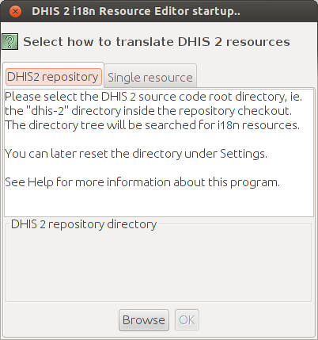
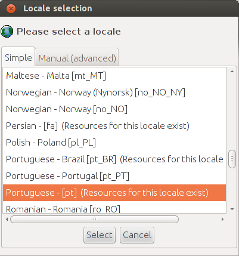
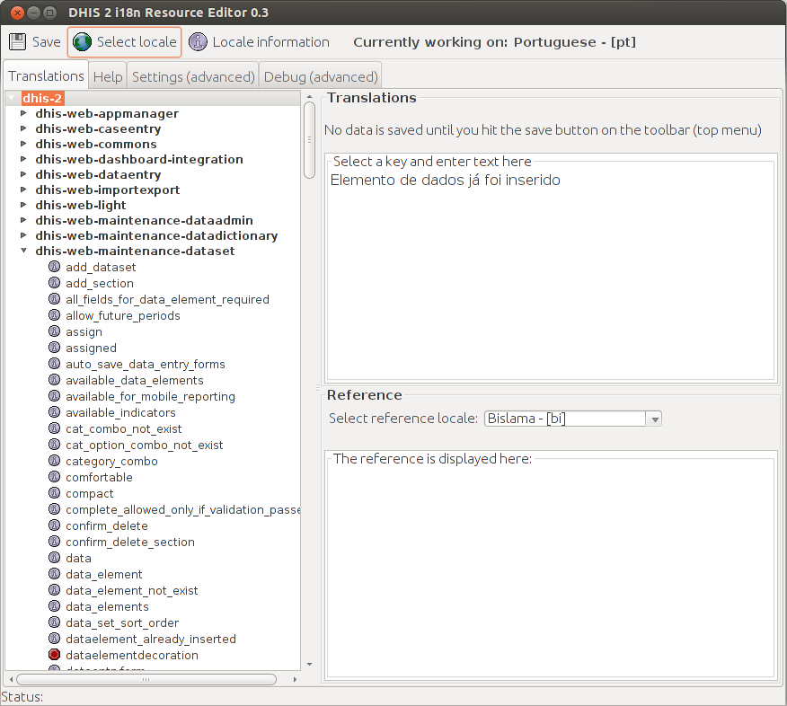
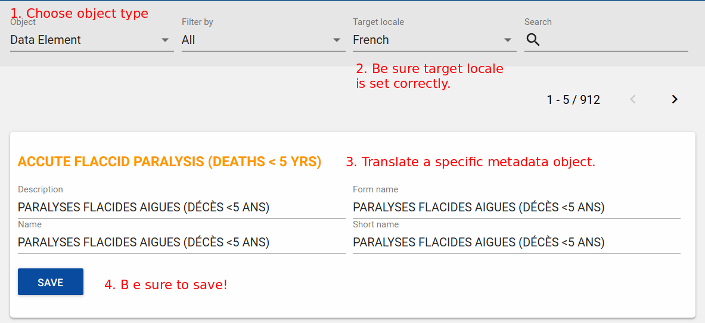

# Localization of DHIS 2

## DHIS 2 localization concepts

<!--DHIS2-SECTION-ID:localization-intro-->

Localization involves the adaptation of an application to a specific
location. When implementing DHIS 2 in a given country, adequate resources
should be allocated to translate and localize the application if required.
Translation of the user interface elements, messages, layout, date and
time formats, currency and other aspects must be considered. In addition
to translation of the user interface itself, metadata content which is
contained in the database must also be considered to be translated.

DHIS 2 supports internationalization (i18n) of the user interface through
the use of Java property strings and PO files. Java property files are used
when messages originate from the back-end Java server, while PO files
are used for front-end apps written in JavaScript. 
The DHIS 2 Android apps use a specific XML format. 
Regardless of the specific format, each element in the user interface has 
been assigned a specific key which is linked to a value. 
As an example,consider the following key/value pairs from a Java property file. 

    org_unit_tree=Organisation Unit Tree
    error_occurred=An error has occurred.

In French the same key/value pairs would appear as follows

    org_unit_tree=Arborescence des unités d'organisation
    error_occurred=Une erreur s'est produite

Note that the keys (text before the = symbol) are the same in both
examples, but the values (after the = ) symbol are in each of the
respective languages. Each of these values would need to be
translated from the original language (English) to the destination
language (e.g. French). When the user specifies French for the user
interface language, all of the strings would then appear in French
instead of the default language (English). Any strings which have not
been translated, would appear in English.

There should always be an English string for all messages in DHIS 2. 
When the user selects a given language, and a translation is present in that 
language, then the translation will be shown. However, if the string in the 
desired language is missing then fallback rules will be applied.  In cases when 
two given translations, such as Portuguese and Brazilian Portuguese share 
common messages, it is not required to perform a full translation in the 
variant language. Only messages which are different should be translated.  
Fallback rules are then applied in the following manner (assuming the user has 
chooses Brazilian Portuguese as their language: 

1.  Display the message in Brazilian Portuguese if it exists. 

2.  If it does not exist in the variant language, then use the Portuguese 
    message, if it exists.

3.  If there is no message in either the base language or the variant language,
    choose the ultimate fallback language, English. 

> **Important**
> 
>   - There are a number of key/value pairs such as
>     "format.FinancialApril.startDate=dd MMM yyyy 'to '" which are used
>     for date/time formatting in various parts of DHIS 2. Part of the value
>     should not be translated because it is actually a special formatting 
>     field used by either Java or JavaScript to interpolate or format a string. 
>     In this example the special string which should be be translated is 
>     "dd MMM yyyy".  The part of the value which can be translated would be 
>     "to", for instance to "a" in Spanish. If these data format template 
>     strings are translated, it may result in errors in the application.
> 
>   - It is not necessary to translate a string from the original
>     language (English) if the translated string is the same. You can
>     simply leave it blank. By default, DHIS 2 will use English values
>     for all strings which have not been translated.
> 
>   - All translated strings must be stored in escaped UTF-8 format. If
>     you are using the DHIS 2 translation portal (discussed below), be sure 
>     your browser settings are set to UTF-8 when translating. If you are using
>     a text editor or other tool such as an IDE, you may need to convert
>     the UTF-8 characters to escaped syntax, using the Java
>     `native2ascii` utility.
> 
>   - Some special variables (e.g. {0} ) use curly brackets. This
>     denotes a variable which will be replaced by a number or other
>     value by the application. You must place this variable notation in
>     the correct position and be sure not to modify it. 

There are a number of tools which can be used to support the
localization of the user interface as well as the database content,
which will be discussed below.

## DHIS 2 i18n tool

<!--DHIS2-SECTION-ID:dhis2-i18n-translations-tool-->

The i18n resource editor is Java desktop application which can beYour translations
downloaded from http://www.dhis2.org/downloads . It requires thatwill be incorporated into the source code on a regular basis by the
have checked out the DHIS 2 source code from GitHub (check out
http://www.dhis2.org/development if necessary) and have a Java Rudevelopment team.e
Environment installed on your computer. On Windows, simply unpack the ZIP
archive and click the executable file. On Linux, extract the archive,
navigate inside the extracted directory and invoke the following:

    java -jar dhis-i18n-resourceeditor.jar

1.  Press "Browse" when the application starts and select the path to
    the "dhis-2" directory inside your local copy (checkout) of the
    DHIS 2 source code repository, followed by OK.
    
    
    
Your translations
will be incorporated into the source code on a regular basis by the
development team.
Your translations
will be incorporated into the source code on a regular basis by the
development team.
Your translations
will be incorporated into the source code on a regular basis by the
development team.
Your translations
will be incorporated into the source code on a regular basis by the
development team.
    to create a country-specific translation, select e.g. "Portuguese -
    Brazil \[pt\_BR\]. Locales which already have keys translated will
    show the text "Resources for this locale exist".
    
    
    

3.  Select one of the web modules from the left hand side to translate,
    e.g. dhis-web-maintenance-dataset.
    
    
    
    
    Once you have selected a module, click on a particular key from the
    left-hand side. A reference value for the key will be displayed in
    the lower right-hand pane, and the translation value will be
    displayed in the upper right-hand pane. Keys with missing values
    will be indicated with a red icon. If the value does not exist,
    simply add the translation there.

4.  Once you have finished translating, make sure to press the "Save"
    button.

5.  Once you have finished all of the translations, please submit a pull 
    request on the appropriate GitHub repository. A member of the development
    team will review the translations for eventual incorporation into the 
    main source code. 

## Using the DHIS 2 translation portal

<!--DHIS2-SECTION-ID:translation-server-->

A web-based portal solution has been setup in order to facilitate the
translation of DHIS 2 into multiple languages. Simply direct your
browser to <https://translate.dhis2.org/> and register for an account by
providing a username, email address and password. The server will send
you a confirmation email which you can use to activate your account.
Once you have activated your account, simply press the "Log in" link
from the main portal page, and provide your username and password.

The first time you login, you should select your settings, by clicking
"My account-\>Settings". Here you can select your interface language,
the projects which you wish to work on, and the languages which you will
translate into. Be sure to press "Save" when you have finished making
your changes.

To start translating, be sure you have logged in, and then press the
"Home" link in the upper-right hand corner. Select a project (e.g.
DHIS 2) and then click on the language which you wish to translate. The
number of words which need to be translated will be displayed under the
"Summary" field. Click on the module you wish to translate and then keep
drilling down through the folders to find a module which needs
translation, (e.g. dhis-web-\>dhis-web-caseentry). Now click on the
"Summary" text which will say something like "194 words need attention".
You will be directed to the string which requires translation.

Simply translate the term, and then press "Submit". 

Once you have finished translating a module/app, please submit a new issue
on <https://jira.dhis2.org>. Your translations will be incorporated on a 
regular basis into the main source code of DHIS 2. 

## Database translation app

<!--DHIS2-SECTION-ID:translations-app-->

In addition to translation of the user interface, DHIS 2 also supports
the localization of the metadata content in the database. It is possible
to translate individual objects through the maintenance app, but in
order to better support a standard translation workflow, a specialized
app has been developed for this purpose. The DHIS 2 translation app can
be used to translate all metadata (data elements, categories,
organization units, etc) into any locale which is present in the
database.

To get started, simply choose the "Translations" app from the top level
menu.

1.  From the top of the app, choose the locale you wish to translate
    into.

2.  Next, choose the type of object you wish to translate from the
    drop-down menu.

3.  Choose the specific object you wish to translate, and translate each
    of the properties (Name, Short name, Description, etc). These
    properties will vary from object to object.

4.  Press "Save" when you are done translating the specific object to
    save your changes.

Note that you can search for a specific term using the search feature in the 
upper right hand corner of the app. 