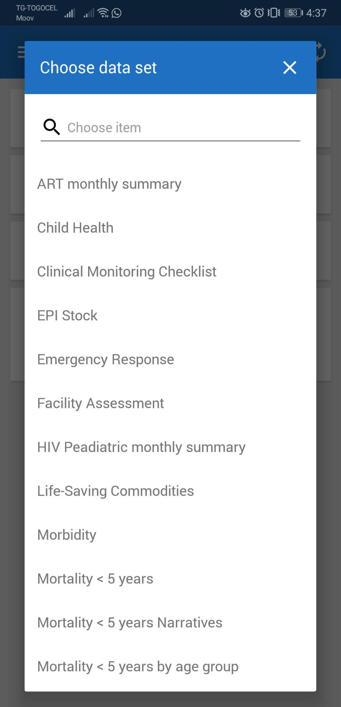
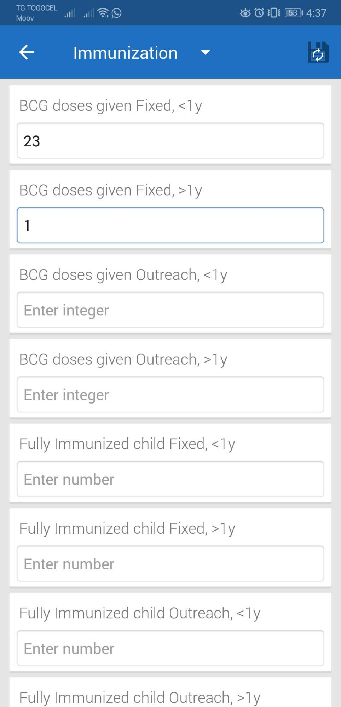
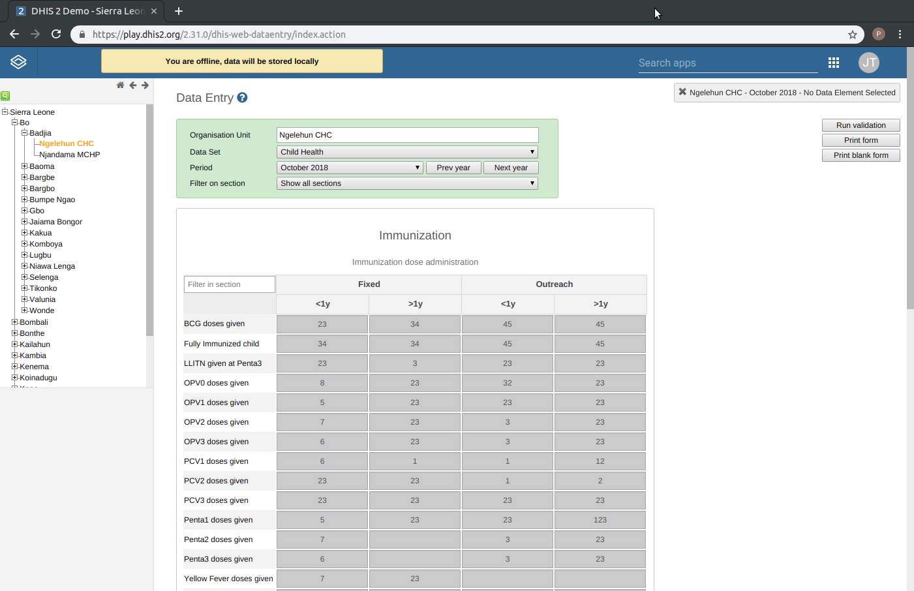

# Guidelines for offline data entry using DHIS 2
<!--DHIS2-SECTION-ID:offline_data_entry-->

The de facto standard way of DHIS 2 deployment has become *online* meaning
that a single instance of the application is set up on a server
connected to the Internet and all users connect to the application using
a web browser over internet. This was made possible possible thanks to
the steady  increase of internet availability (mostly mobile internet),
the offerings of readily available and cheap cloud-computing resources
combined with the fact that DHIS 2 does not request a significant
bandwidth. These developments make it possible to access on-line servers
in even the most rural areas using mobile Internet modems (also referred
to as dongles).

This on-line deployment style has huge positive implications for the
implementation process and application maintenance compared to the
traditional off-line standalone style:

**Hardware**: Hardware requirements on the end-user side are limited to a
reasonably modern computer/laptop and Internet<!-- Mention phone, since android is listed as
alternative? --> connectivity through a fixed line or a mobile modem. There is no need
for a specialized server for each user, any Internet enabled computer
will be sufficient. A server will be required for on-line deployments,
but since there is only one (or several) servers which need to be
procured and maintained, this is significantly simpler (and cheaper)
than maintaining many separate servers is disparate locations. Given
that cloud-computing resources continue to steadily decrease in price
while increasing in computational power, setting up a powerful server in
the cloud is far cheaper than procuring hardware.

**Software platform**: The end users only need a web browser to connect to
the on-line server. All popular operating systems today are shipped with
a web browser and there is no special requirement on what type or
version<!--I’m not sure this is true, at least in practice -->. This means that if severe problems
such as virus infections or software corruption occur one can always
resort to re-formatting and installing the computer operating system or
obtain a new computer/laptop. The user can continue with data entry
where it was left and no data will be lost.

**Software application**: The central server deployment style means that the
application can be upgraded and maintained in a centralized fashion.
When new versions of the applications are released with new features and
bug-fixes it can be deployed to the single on-line server. All changes
will then be reflected on the client side the next time end users
connect over the Internet. This obviously has a huge positive impact for
the process of improving the system as new features can be distributed
to users immediately, all users will be accessing the same application
version, and bugs and issues can be sorted out and deployed
on-the-fly<!-- Bugs can be deployed on-the-fly! -->.

**Database maintenance**: Similar to the previous point, changes to the
meta-data can be done on the on-line server in a centralized fashion and
will automatically propagate to all clients next time they connect to
the server. This effectively removes the vast issues related to
maintaining an upgraded and standardized meta-data set related to the
traditional off-line deployment style. It is extremely convenient for
instance during the initial database development phase and during the
annual database revision processes as end users will be accessing a
consistent and standardized database even when changes occur frequently.

Although a DHIS 2 implementation can be labeled as online, it is worth
noting that such deployment may not purely online and may some local
variation depending local constraints. For example, while most users in
countries enjoy easy access to their national DHIS 2 instance using their
mobile internet or better<!-- Other? Fixed might not be better... --> connectivity means,
some unfortunately still struggle to access the system either for data
entry or analysis in places where Internet connectivity is volatile or
missing in long periods of time. And for these struggling users,
alternatives ways to interact with the system need to be found.

This guideline aims at providing advice on how mitigate the effect of
lack reliable internet in challenging settings.

#  Cases and corresponding solutions
<!--DHIS2-SECTION-ID:offline_data_entry_cases-->

In this section, we will examine possible challenging cases and describe
possible ways to address them or to minimize their effects on users and
the entire system on a short term.  Obviously, the possible solutions
proposed in this guidelines should be adapted in each context by taking
into account many other parameters such as security, local practices and
rules etc. The thinking in this guideline is not to prescribe bullet
proof solutions that can work everywhere but propose ways of addressing
connectivity issues in some places in the country. 

We identify three (3) main scenarios:

  - Limited internet availability and data entry forms are small
  - Limited internet availability and data entry forms are huge
  - Internet is not at all available 

We recognize that these scenarios are very simplistic because in
practice a health facility can have for instance one  small weekly form
for disease surveillance, one big form for monthly progress report and a
middle sized form for a health program. This makes the number of
possible scenarios  for a given setting greater than what is spelled out
here. It will be therefore for up to each implementation team to discuss
with the stakeholders to make simple choices that address all of the
scenarios in a given setting. In most cases about 80 to 95% of
districts<!-- Do we have a source for this? --> (or health facilities if data entry
is done at this level) will have the same configuration regarding
internet availability and only the the remain 5 to 20% will need
alternative ways to get their data in DHIS 2.

## Limited internet availability (instability of signal or limited mobile data) and data entry forms are small 
<!--DHIS2-SECTION-ID:offline_data_entry_cases_small-->

By limited internet availability, we mean case where:

  - network signal is available and good but there is not enough
    resources to buy adequate mobile data to work continuously online
  - network is good but fluctuates or is only available at a given
    period in the day
  - network signal is weak but improves from time to time to allow
    connection to DHIS 2

And by data entry form not huge we mean data entry form having one to
about one hundred<!-- If I had guessed what «Small» meant, I would say
10-20 --> fields.

So if  internet connectivity is limited and data entry forms are small,
there are two possibilities to address the connectivity problem: Android
data capture app and web data entry offline capability.

### Use of Android data capture app:
<!-- Need to make sure this is updated with release of new
apps -->

The Data Capture for DHIS 2 app allows users to enter data into a DHIS 2
server with an Android device. The app downloads instances of forms
which are required to enter data from the server, and stores them on the
device. This means that users can enter data offline for facilities they
are assigned to and then upload it to the DHIS 2 server when they have
network coverage.

To do this, the users will  be request to go to the Google Play from
their Android device and type DHIS 2 data capture and get the following
screen. 

Then install the app called Data Capture for DHIS 2.

Once the app is installed and launched, the user will be requested to
provide the url of their national DHIS 2, the username and password and
tap LOG IN.

After a successful log in, the app will download automatically the
forms and organization units the user is assigned to and store them
locally for data entry. From here, any subsequent use of the app for
data entry will not require internet connection as instances of forms
are already stored locally. Internet connection will be needed only to
sync data with the server. This can be done when internet is available
locally.

On the system administration side, organizing the data entry form into
sections in DHIS 2 will make data entry experience more fluid and
enjoyable.

As for the synchronization, when internet connectivity is not available
when needed, the user take the mobile device to the district – during
the district meeting – or to the nearest area where internet is
available.

### Use of the offline capability of DHIS 2 web data entry module

The web data entry module is the module inside DHIS 2 allowing for data
entry using the we browser. The is in DHIS 2 the regular way of data
entry online. However it does have also an “offline” capability that
support the continuation of data entry even when the internet is
interrupted. This means that is the user want to do data entry at the
end of the month for instant, he has to first connect to internet, log
in to DHIS 2 and open the data entry forms for at least one of the
facilities he is assigned to. From this step, he can disconnect his
internet and continue data entry for all his facilities  and for the
periods he wants as long as the data entry web page window is not closed
in the web browser.  After finishing the data entry, he can close the
browser and event shutdown his computer. The data entered will be stored
locally in the cache of the browser and the next time the user will get
online and log in DHIS 2 he will be asked to click on a button to upload
it. 

For this case, it is possible to use either android data entry app or
the semi-offline web based feature in DHIS 2 or both depending on the
size of data entry forms.<!-- Not clear what "For this case" refers to -->
However, clearing the cache of the browser will result in the lost of the data stored
locally. Therefore, it is recommended to not clear the cache without
making sure that data locally stored is synced. 

When the user is logged in and internet is cut (deliberately or not)

 <!-- PALD: This screenshot was 
taken when the home icon ()top left corner) was broken. I suggest we replace this image! -->

When internet is back and the user log in DHIS 2

## Limited internet availability and data entry forms are huge
<!--DHIS2-SECTION-ID:offline_data_entry_cases_huge-->

<!-- Does the PDF data entry option still exist? Where you could generate PDF-based data entry forms that could be managed offline and then be uploaded?-->

When internet but the availability is limited but the data entry form
contains several hundreds of fields, it limits possible solutions. In
this case it is not advisable to use the android capture for two
reasons:

  - it can regularly crash because it is not designed to handle forms of
    very big size<!-- We could perhaps de-emphasise this point.. -->
  - it can turn out to be tedious and eye exhausting for users because
    the screen is small and does not allow for fast data entry

Thus the only option available is to use the web data entry module
offline capability described above or move to the nearest place where
internet is available when the user cannot afford to wait the next time
internet will be available in his area.

## Internet is not at all available
<!--DHIS2-SECTION-ID:offline_data_entry_cases_no_available-->

In this case there are three options:

  - Use of the Android capture app for data entry locally and sync the
    data at the upper level where internet is available if the user
    attends regular meetings there. This is only feasible if the forms
    are small
  - Move to the nearest place (if affordable) or use the opportunity of
    regular meeting at the upper level to capture data with the web data
    entry module. In this case depending on the internet connectivity
    the user can either work online or use the offline capability
    described in section [2.1](#offline_data_entry_cases_small). 
  - Ask the upper level where internet is available to do data entry
    regardless of the size of the form. Although this data entry happens
    at upper level, data can still be entered for every health facility.
    

<!-- Seems natural with some sort of conclusion or
summary -->
