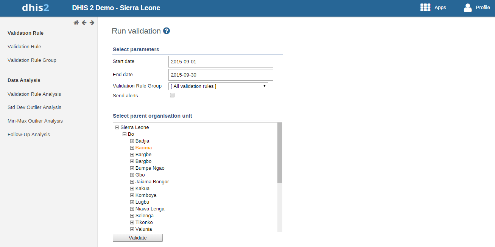
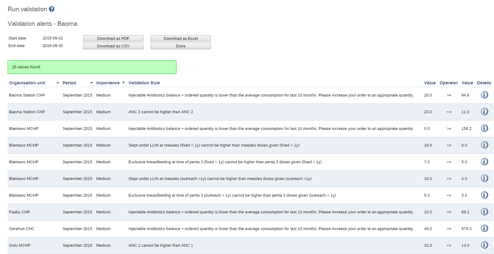
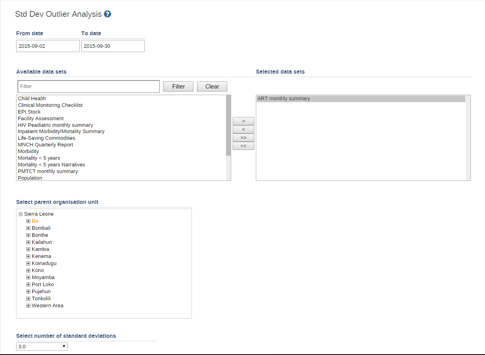

# Control data quality

<!--DHIS2-SECTION-ID:control_data_quality-->

## About data quality checks

<!--DHIS2-SECTION-ID:about_data_quality-->

The **Data Quality** app contains tools to validate the accuracy and
reliability of the data in the system. You can verify the data quality
with the help of validation rules and various statistical checks. Data
quality has different dimensions including:

<table>
<colgroup>
<col style="width: 50%" />
<col style="width: 50%" />
</colgroup>
<thead>
<tr class="header">
<th>
Dimension
</th>
<th>
Description
</th>
</tr>
</thead>
<tbody>
<tr class="odd">
<td>
Correctness
</td>
<td>
Data should be within the normal range for data collected at that facility. There should be no gross discrepancies when compared with data from related data elements.
</td>
</tr>
<tr class="even">
<td>
Completeness
</td>
<td>
Data for all data elements for all reporting organisation units should have been submitted.
</td>
</tr>
<tr class="odd">
<td>
Consistency
</td>
<td>
Data should be consistent with data entered during earlier months and years while allowing for changes with reorganization, increased work load, etc. and consistent with other similar facilities.
</td>
</tr>
<tr class="even">
<td>
Timeliness
</td>
<td>
All data from all reporting organisation units should be submitted at the appointed time.
</td>
</tr>
</tbody>
</table>

You can verify data quality in different ways, for example:

  - At point of data entry, DHIS2 can check the data entered to see if
    it falls within the minimum maximum value ranges of that data
    element (based on all previous data registered).

  - By defining validation rules, which can be run once the user has
    finished data entry. The user can also check the entered data for a
    particular period and organization unit(s) against the validation
    rules, and display the violations for these validation rules.

  - By analysing data sets, that is, examine gaps in the data.

  - By data triangulation, that is, comparing the same data or indicator
    from different sources.

## Validation rule analysis

<!--DHIS2-SECTION-ID:validation_rule_analysis-->

### About validation rule analysis

A validation rule is based on an expression which defines a relationship
between data element values. The expression forms a condition which
should assert that certain logical criteria are met.

The expression consist of:

  - a left side

  - a right side

  - an operator

A validation rule could assert that "Suspected malaria cases tested" \>=
"Confirmed malaria cases".

The validation rule analysis tests validation rules against the data
registered in the system. Validation violations are reported when the
condition defined in the validation rule expression is not met, which
means when the condition is false.

You can configure a validation rule analysis to automatically send out
information about validation violations to selected user groups. These
messages are called *validation notifications* and you create them in
the **Maintenance** app. Validation notifications are sent via the
internal DHIS2 messaging system.

### Workflow

1.  In the **Maintenance** app, create validation rules and validation
    rule groups.

2.  (Optional) In the **Maintenance** app, create validation
    notifications.

3.  Run the validation rule analysis, either automatically or manually.
    
      - In the **Data Administration** app, you schedule the validation
        rule analysis to run automatically for all validation rules
        included in one or several validation notifications. After the
        system has run the analysis, you'll see the validation
        violations (if any) in the validation notifications sent via the
        internal DHIS2 messaging system.
    
      - In the **Data Quality** app, you run the validation rule
        analysis manually for selected validation rules. After the
        analysis process has finished, you'll see a list of validation
        violations (if any).

### Schedule a validation rule analysis to run automatically

> **Note**
> 
> Only validation rules that are included in one or several validation
> notifications will be a part of the validation rule analysis. If
> there's no corresponding validation notification for a validation
> rule, the system has nowhere to send the validation violations.

> **Note**
> 
> While running validation rule analysis automatically, any results not
> already persisted, will be persisted during this run. Persisted
> results can currently only be accessed trough the api.

1.  Verify that you have created all the validation rules, validation
    rule groups and validation notifications you need.

2.  Open the **Data Administration** app and click **Scheduling**.

3.  If scheduling is active, click **Stop**.

4.  In the **Data monitoring** section, select **All daily**.

5.  Click **Start**.

### Run a validation rule analysis manually

1.  Verify that you have created all the validation rules, validation
    rule groups and validation notifications you need.

2.  Open the **Data Quality** app and click **Validation rule
    analysis**.

3.  Select **Start date** and **End date**.

4.  Select which **Validation rule group** you want to include in the
    analysis.
    
    You can select all validation rules or all validation rules from a
    single validation rule group.

5.  (Optional) Select **Send notifications** to trigger validation
    notifications.
    
    > **Note**
    > 
    > If you want to send out validation notifications, you must first
    > create them in the **Maintenance** app.

6.  (Optional) Select *Persist new results* to persist any non-persisted
    results found during the analysis

7.  Select a **Parent organisation unit**.

8.  Click **Validate**.
    
    The analysis process duration depends on the amount of data that is
    being analysed. If there are no violations of the validation rules,
    you'll see a message saying *Validation passed successfully*. If
    there are validation violations, they will be presented in a
    list.
    
    

9.  (Optional) Click the show details icon to get more information about
    a validation violation. In the pop-up window you'll find information
    about the data elements included in the validation rules and their
    corresponding data values. You can use this information to identify
    the source of the validation rule violation.

10. (Optional) Click **Download as PDF**, **Download as Excel** or
    **Download as CSV** to download the validation violations list in
    PDF, Excel or CSV formats.

### See also

  - [Manage validation
    rules](https://docs.dhis2.org/master/en/user/html/manage_validation_rule.html)

  - [Data Administration
    app](https://docs.dhis2.org/master/en/user/html/data_admin.html)

## Standard deviation outlier analysis

<!--DHIS2-SECTION-ID:standard_deviation_analysis-->

### About standard deviation outlier analysis

The standard deviation outlier analysis identifies values that are
numerically distant from the rest of the data. The analysis is based on
the standard normal distribution. The system calculates the average,
based on values since the beginning of time, for one particular
combination of organisation unit, data element, category option
combination and attribute option combination. Outliers can occur by
chance but often indicate a measurement error or a heavy-tailed
distribution which leads to very high numbers. You should investigate
measurement errors and try to correct them before you discard them from
the analysis.

> **Warning**
> 
> It's not recommended to use tools or interpretations that assume a
> normal distribution for heavy-tailed distributions.
> 
> For example: the standard deviation outlier analysis is not an
> appropriate tool when you expect huge seasonal variations in the
data.

### Run a standard deviation outlier analysis

1.  Open the **Data Quality** app and click **Std dev outlier
    analysis**.

2.  Select **From date** and **To date**.

3.  Select data set(s).

4.  Select **Parent organisation unit**.
    
    All children of the organisation unit will be included. The analysis
    is made on raw data "under" the parent organisation unit, not on
    aggregated data.

5.  Select a number of standard deviations.
    
    This refers to the number of standard deviations the data is allowed
    to deviate from the mean before it is classified as an outlier.

6.  Click **Start**.
    
    The analysis process duration depends on the amount of data that is
    being analysed. If there are standard deviations outliers, they will
    be presented in a
    list.
    
    
    
    For each outlier, you'll see the data element, organisation unit,
    period, minimum value, actual value and maximum value. The minimum
    and maximum values refer to the border values derived from the
    number of standard deviations selected for the analysis.

> **Tip**
> 
> Click the star icon to mark an outlier value for further follow-up.

### Modify a standard deviation outlier value

You can modify an outlier value directly in the analysis result list:

1.  In the value column, click inside the field that contains the value
    you want to change.

2.  Enter a value and then navigate away from that field either by
    clicking tab or anywhere outside the field.
    
    The system provides an alert if the value is still outside the
    defined minimum and maximum values, but the value will be saved in
    any case. The field will have a red background color if the value is
    outside the range, and a green if inside.

## Minimum maximum outlier analysis

<!--DHIS2-SECTION-ID:min_max_analysis-->

### About minimum maximum value based outlier analysis

You can verify the data quality at the point of data entry by setting a
minimum maximum value range for each data element. You create the value
ranges manually or generate them automatically.

The auto-generated minimum maximum value range is suitable only for
normally distributed data. DHIS2 will determine the arithmetic mean and
standard deviation of all values for a given data element, category
option, organisation unit and attribute combination. Then the system
will calculate the minimum maximum value range based on the **Data
analysis std dev factor** specified in the **System Settings** app.

For data which is highly-skewed or zero inflated (as is often the case
with aggregate data), the values which DHIS2 auto-generates may not
provide an accurate minimum maximum value range. This can lead to
excessive false violations, for example if you analyse values related to
seasonal diseases.

> **Note**
> 
> Minimum maximum value ranges are calculated across all attribute
> combination options for a given data element, category option and
> organisation unit combination.

### Workflow

1.  Create a minimum maximum value range, either automatically or
    manually.
    
      - In the **Data Administration** app, you generate value ranges
        automatically.
    
      - In the **Data Entry** app, you set value ranges manually for
        each field.

2.  In the **Data Quality** app, run the **Min-max outlier analysis**.

### Configure a minimum maximum outlier analysis

#### Create minimum maximum value range automatically

> **Note**
> 
> Auto-generated minimum maximum value ranges can be useful for many
> situations, but it's recommended to verify that the data is actually
> normally distributed prior to using this function.

You generate minimum maximum value ranges calculated by data set in the
**Data Administration** app. The new value ranges override any value
ranges that the system has calculated previously.

1.  Set the **Data analysis std dev factor**:
    
    1.  Open the **System Settings** app, and click **General**.
    
    2.  In the **Data analysis std dev factor** field, enter a value.
        
        This sets the number of standard deviations to use in the
        outlier analysis. The default value is 2. A high value will
        catch less outlier values than a low value.

2.  Open the **Data Administration** app and click **Min-max value
    generation**.

3.  Select data set(s).

4.  Select an **Organisation unit**.

5.  Click **Generate**.
    
    New minimum maximum value ranges for all data elements in the
    selected data sets for all organisation units (including
    descendants) of the selected organisation units are generated.

#### Create minimum maximum value range manually

1.  In the **Data Entry** app, open a data entry form.

2.  Double-click the field for which you want to set the minimum maximum
    value range.

3.  Enter **Min limit** and **Max limit**.

4.  Click **Save**.
    
    If values don't fall within the new value range the next time you
    enter data, the data entry cell will appear with an orange
    background.

5.  (Optional) Type a comment to explain the reason for the discrepancy,
    for example an event at a facility which may have generated a large
    number of clients.

6.  (Optional) Click **Save comment**.

> **Tip**
> 
> Click the star icon to mark the value for further follow-up.

#### Delete minimum maximum value range

You can permanently delete all minimum maximum value ranges for selected
data sets and organisation units in the **Data Administration** app.

1.  Open the **Data Administration** app and click **Min-max value
    generation**.

2.  Select data set(s).

3.  Select an **Organisation unit**.

4.  Click **Remove**.

### Run a minimum maximum outlier analysis

1.  Verify that you've created minimum maximum value ranges.

2.  Open the **Data Quality** app and click **Min-max outlier
    analysis**.

3.  Select **From date** and **To date**.

4.  Select which data set(s) you want to include in the analysis.

5.  Select **Parent organisation unit**.
    
    All children of the organisation unit will be included. The analysis
    is made on raw data "under" the parent organisation unit, not on
    aggregated data.

6.  Click **Start**.
    
    The analysis process duration depends on the amount of data that is
    being analysed. If there are validation violations, they will be
    presented in a list.
    
    

7.  (Optional) Click **Download as PDF**, **Download as Excel** or
    **Download as CSV** to download the list in PDF, Excel or CSV
    formats.

> **Tip**
> 
> Click the star icon to mark the value for further follow-up.

## Follow-up analysis

<!--DHIS2-SECTION-ID:follow_up_analysis-->

### About follow-up analysis

The follow-up analysis creates a list of all data values marked for
follow-up. You can mark a data value for follow-up in the **Data Entry**
app and in the result list you get from a standard deviation outlier or
minimum maximum outlier analysis.

### Create list of data values marked for follow-up

1.  Open the **Data Quality** app and click **Follow-up analysis**.

2.  Select an **Organisation unit**.
    
    The analysis process duration depends on the amount of data that is
    being analysed. If there are data values marked for follow-up, they
    will be presented in a list.
    
    

3.  (Optional) Click **Download as PDF**, **Download as Excel** or
    **Download as CSV** to download the validation violations list in
    PDF, Excel or CSV formats.

> **Tip**
> 
> Click the star icon to remove the follow-up tag from the data value.

