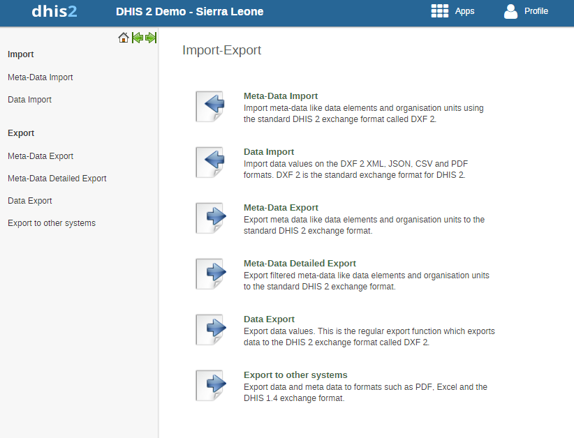
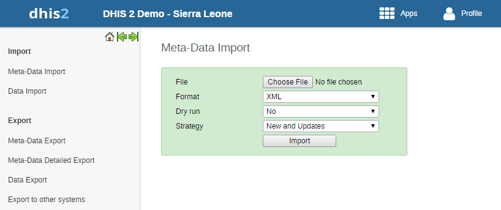
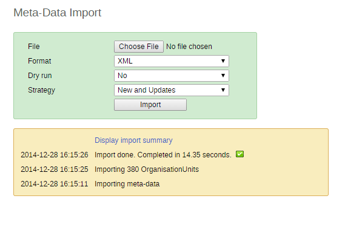
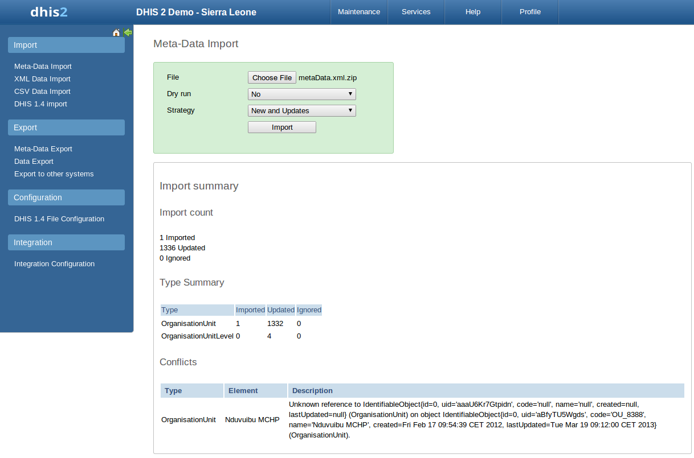
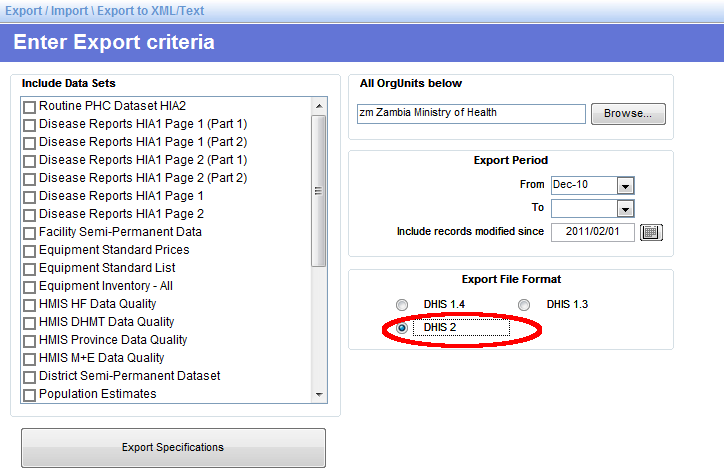
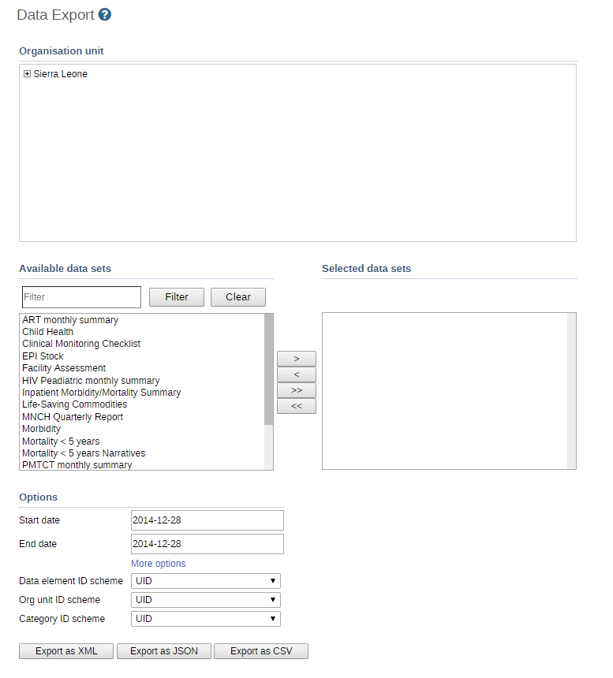
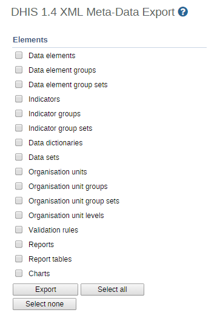
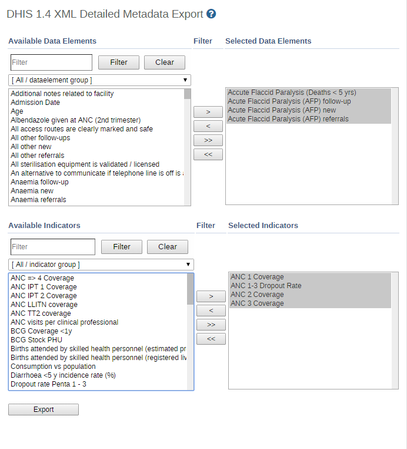
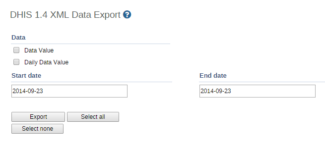

# Import and export data and metadata

<!--DHIS2-SECTION-ID:import_export-->

In a primary health system, the HMIS typically involves a distributed
application, where the same application is running in different
geographical locations (PHCs,CHCs, hospitals, districts, and state).
Most of these physical locations do not have Internet connectivity, and
hence they work off-line. At some point (normally at the district
level), the data needs to be synchronised in order to have a
consolidated database for the a particular geographical region. For
this, it is important to be able to export data from one location (which
is working offline, say at the health facility level) to another one say
at the district level where the data would need to be imported. This
feature of exporting and importing is thus a crucial function of a HMIS.
This feature also helps us overcome the dependency on Internet to some
degree, as data updates can be transferred via USB key where there is no
connectivity, or through email where there is limited Internet
connectivity. DHIS2 provides robust export-import functionality to
fulfill these needs.

To access the main Import-Export module, choose
Services-\>Import-Export.A number of services are available, all of
which will be described in detail in respective sections below.

## Meta-data import

### Meta-data import

Meta-data objects can be easily imported by accessing
Import-Export-\>Meta-Data import. Select the file to import by pressing
"Select" and choose the file from your local file system. When importing
XML and JSON files, the system will automatically detect which type of
objects which should be imported. When importing CSV metadata, you will
need to specify the object type. Consult the corresponding section in
this manual on "CSV Metadata import" for more specific information on
how the CSV file should be created.

There are two separate options for importing data.

  - Dry run: This is similar to the old preview option, this will do a
    dry run import, and give you information about any errors.

  - Strategy: There are three options here, "New and Updates", "New
    only", and "Update only". New and updates tells the importer to
    expect both new meta-data, and updates to existing ones. New only
    will only accept fresh meta-data, usually you would use this on a
    empty database. Updates only will only allow the meta-data to match
    meta-data that is already there (same identifiers, new name etc).

> **Note**
> 
> **It is highly recommend always using the Dry run option** when
> importing data to make sure you keep control over any changes to your
> meta-data and databases being out of synch on data elements or
> organisation unit names

#### Dry run before importing

Before doing the import into your database, it is highly recommended
that you run the import with the dry run option set to true first. This
will enabled you to have a look at how many new, updates, and ignored
meta-data there will be. After you have selected your file, set dry run
to true, you can now click the import button. After doing this, you will
be greeted by this window.

Here you can see a short summary of what was contained in your import
file. To see further details, please click on the "Display import
summary" link.

Here you can see that the import dry run was successful and the import
contained **1** new organisation unit, **1332** updated, and **4**
organisation unit levels.

Below you can see another example.

Here you can see that the organisation unit "Nduvuibu MCHP" had a
unknown reference to an object with ID "aaaU6Kr7Gtpidn", which means
that an object with this ID was not present in your imported file, and
it could not be found in the existing database. Its important to note
that even if a reference could not be found, the object will still be
imported, but you might have to fix this directly in DHIS2 later, if the
reference should have pointed to something else.

#### Matching identifiers in DXF2

The DXF2 format currently support matching for two identifiers, the
internal DHIS2 identifier (known as a UID), and also using an external
identifier called called a "code". When the importer is trying to search
for references (like the one above), it will first go to the UID field,
and then to the code field. This allows you to import from legacy
systems without having a UID for every meta-data object. I.e. if you are
importing facility data from a legacy system, you can leave out the ID
field completely (DHIS2 will fill this in for you) and the put the
legacy systems own identifiers in the code field, this identifier is
required to be unique. This not only works for organisation units, but
for all kinds of meta-data, allowing for easy import from other systems.

### Import CSV meta-data

To import CV meta-data go to import-export module and select CSV
Meta-Data Import form the left side menu. You must select the object
type which your CSV file contains. You can only upload one type of
objects at the time. Upload your file and click update. For the CSV
format, please visit the Web API chapter \> CSV meta-data import in the
developer guide.

### GML data import

The GML import function can be used to import data prepared in the
Geography Markup Language (GML). GML can be used to update the
coordinates (both polygons and points). Once you have prepared your GML
file as detailed in the chapter on "Importing coordinates", you can load
the file with this function.

Importing the organisation unit hierarchy from GML is not supported.
Therefore you should create the organisation unit hierarchy separately,
and then use GML to update the coordinates once the hierarchy has been
created.

## Import data

<!--DHIS2-SECTION-ID:import-->

The import option allows different instance of DHIS2 to receive
standardised sets of data in the absence of a networked system. The
functionality can also be used to import data produced by another system
(perhaps on a regular basis) or to import legacy data which has been
transformed into a format which DHIS2 can understand. Typically, a data
set is exported from one DHIS2 instance (e.g. a district level system)
to another system (e.g. a provincial level system). DHIS2 is also
capable of importing data directly from a DHIS2 1.4 Access database.
Each of these options will be discussed in the following sections.

### XML data import

<!--DHIS2-SECTION-ID:import_another_instance-->

To import data in XML format, simply select
Services-\>Import-export-\>XML data import. Similar options to the XML
meta-data import facility are available. Please refer to the Developer
guide \> Web API \> Data values chapter on XML data import for details
on the XML format which is used by DHIS2 for aggregate data import.

### Import CSV data

<!--DHIS2-SECTION-ID:importCSVdata-->

DHIS2 supports import of data in the CSV (Comma Separated Values)
format. This can be used to import exchange file produced by DHIS2
itself. It also comes in handy when you want to import data from a
third-party system as CSV is widely supported in applications and is
easy to produce manually.

To import a CSV data exchange file navigate to the *CSV Data Import*item
in the left-side menu. Upload the exchange file and click *Import*. CSV
files can be imported both as plain text file or as compressed ZIP file
archive.

Please refer to the Developer guide \> Web API \> Data values chapter on
CSV data import for a description of the CSV format to use.

### Event data import

Event data can also be easily imported with the "Event data import"
function. Refer to the section in the WebAPI for more information on the
format used for importing events. Otherwise, the functionality is the
same as the XML data import used for aggregate data.

### Import PDF data

<!--DHIS2-SECTION-ID:importPDFdata-->

DHIS2 supports import of data in the PDF format. This can be used to
import data produced by off-line PDF data entry forms. Please refer to
the section "Data set management" for details on how to produce a PDF
form which can be used for off-line data entry.

To import a PDF data file, navigate to the *PDF Data Import*item in the
left-side menu. Upload the completed PDF file and click *Import*.

After the import process is finished, you can follow the link to the
import summary, which will inform you about the outcome of the import
process in terms of number of records imported, updated and ignored and
potential conflicts.

### Import data from DHIS2 1.4

<!--DHIS2-SECTION-ID:dhis14import-->

There are two ways to import data from a DHIS2 1.4 database; 1) through
the 1.4 XML-based export files, or 2) directly from the DHIS2 1.4 data
file (.mdb). Both are accessible from the DHIS2 1.4 Import menu under
Import in the Import-Export module.

It is critical that all data integrity violations which are present in
the DHIS2 1.4 database be fully resolved before attempting an import
into DHIS2. You can check the data integrity of DHIS2 1.4 through the
CORE Module-\>Advanced-\>Data integrity checks. A report will be
generated of all data integrity violations which should be resolved
prior to importing into DHIS2.

> **Warning**
> 
> When data is imported from DHIS2 1.4, both the meta-data as well as
> data are imported. You should therefore be exceedingly careful that
> the meta-data present in DHIS2 1.4 is compatible with your DHIS2 data,
> otherwise during a DHIS2 1.4 data import, the meta-data in the DHIS2
> system will be potentially overwritten by the i

#### DHIS2 1.4 File (database) Import

This method is recommend when doing large imports from 1.4, and
especially when importing into a new DHIS2 database.

**DHIS2 1.4 File Configuration**

Before you can start the 1.4 file import you need to provide a few
details about the 1.4 database:

*Datafile(\#):* Here you put the full path to the DHIS2 1.4 data file
you want to import from, e.g. C:\\DHIS14\\DHIS\_\#LR\_LIBERIA.mdb.

*Username:* Leave blank (unless you have set up extra security measures
on the file)

*Password:* Leave blank (unless you have set up extra security measures
on the file)

*Levels:* Provide the number of levels in the orgunit hierarchy in your
1.4 database, e.g. 5.

Click "Save" and you will return to the DHIS2 1.4 File Import window.

**Import Type:**

As with other imports you have the options to Import (directly),
Preview, or Analyse the import. We recommend using the Analyse option
first to check that the 1.4 database is OK and ready to be imported.

When importing a large database into a new blank DHIS2 database we
recommend using the Import option to save time.

For smaller incremental imports the Preview is OK.

**Last Updated:**

If you want the full import, all the data in the 1.4 database you leave
this field blank.

If you only want to do an incremental import into an already existing
DHIS2 database you can use this field to filter which data values to
import. Only values added or edited after the date you specify will be
imported. This filter makes use of the LastUpdated column in the
RoutineData table in the DHIS2 1.4 data file.

**Import process:**

When you are done selecting Method, and LastUpdated you can begin the
import by clicking on the Import button. This process might take a long
time, depending on how many data values you are importing. On a
reasonable spec. computer the import takes about 2 million records per
30 minutes.

#### DHIS2 1.4 XML Import

Import though XML data from DHIS2 1.4 is also possible using the
standard DHIS2 1.4 export format. Just be sure that the DHIS2 1.4 export
format has been set to "DHIS 2" as illustrated in the screen shot below.
After the data has been exported by DHIS2 1.4, you can import the data
by choosing "Services-\>Import-Export-\>DHIS 1.4 Import-\>DHIS2 1.4 XML
Import" and proceeding via the procedure outline in the [previous
section](#import_another_instance).

#### Limitations to DHIS2 1.4 imports

Although it is possible to import and export data between instances of
DHIS2 1.4 and DHIS2, there are significant limitations. Currently, the
import of some metadata is not supported from DHIS2 1.4 to DHIS2. This
includes:

  - Organisational unit alternate names

  - Compulsory data element pairings

  - Custom data entry forms

  - Dataset data entry levels

It is also important that the aggregation operator defined in DHIS2 1.4
be set to the correct value. Some data, such as population, should have
their aggregation operator set to "Average" in DHIS2, as this controls
how the aggregation of data is handled over time (but not within the
organisational unit hierarchy).

## Export data and meta-data

<!--DHIS2-SECTION-ID:export-->

DHIS2 makes it possible to export various types of data in multiple data
formats. You can export your data, also referred to as measures or
facts; and your meta-data, which refers to the information describing
your data. Data can be exported both in raw, non-aggregated format and
in aggregated format. It is also possible to export a combination of
data and meta-data in case you have special requirements. This chapter
covers mainly how to export data and meta-data through the user
interface of the import-export DHIS2 module. Data can also be exported
programmatically through the DHIS2 Web API, and it is useful to be aware
of the various options available:

  - Export raw, non-aggregated data through the user interface: Covered
    in this chapter.

  - Export aggregated data programmatically through the Web API: Please
    refer to the Web API chapter, section on Analytics.

  - Export a combination of data and meta-data: Please refer to the SQL
    view sections in the Data administration chapter and Web API
    chapter.

  - Export meta-data through the user interface: Covered in this
    chapter.

  - Export meta-data programmatically through the Web API: Please refer
    to the Web API chapter, section on meta data.

Data can be exported on various formats, including DXF 2 (the DHIS2
meta-data and data exchange format based on XML), CSV, PDF, MS Excel and
the DHIS2 1.4 XML format.

Another aspect of data export is the type of DHIS2 deployment. In the
case of online deployment, all data is saved into a single database
only. In an offline deployment, each instance will store data in a
separate database in their local system. In an offline deployment, after
the data entry is finished, data will have to be manually sent to the
next level in the organizational hierarchy. In an on-line application
this is not required, as all data is captured over an Internet
connection and stored in a central location.

### Metadata export

Meta-data is "data about data". In the context of DHIS2, meta-data
consists of definitions of data elements, indicators, the structure and
names contained in the organizational hierarchy, and other options.
Click on the "Meta-data export" link from the main "Data export" screen
in order to access this. Just select the features, format, and the
compression that you want and click "Export". This metadata file can
then be transmitted just like a data file, except it will contain
information on the definitions of the various features, as opposed to
the values of the data themselves.

Simply choose the objects which you would like to export, and click
"Export".

### Metadata export with dependencies

<!--DHIS2-SECTION-ID:metadata_export_dependencies-->

Metadata export with dependencies lets you create canned exports for
metadata objects. This type of export will include the metadata objects
and the metadata object's related objects, that is the metadata which
belong together with the main object.

<table>
<caption>Object types and their dependencies</caption>
<colgroup>
<col width="50%" />
<col width="50%" />
</colgroup>
<thead>
<tr class="header">
<th>
Object type
</th>
<th>
Dependencies included in export
</th>
</tr>
</thead>
<tbody>
<tr class="odd">
<td>
<strong>DHIS2_SECTION_ID:docs-internal-guid-4a3662ce-63b9-1efd-e640-8ba874d1bcde:Data set</strong>
</td>
<td>
Data elements

Sections

Indicators

Indicator types

Attributes

Data entry forms

Legend sets

Legends

Category combinations

Categories

Category options

Category option combinations

Option sets
</td>
</tr>
<tr class="even">
<td>
Program
</td>
<td>
Data entry form

Tracked entity

Program stages

Program attributes

Program indicators

Program rules

Program rule actions

Program rule variables

Program attributes

Data elements

Category combinations

Categories

Category options

Category option combinations

Option sets
</td>
</tr>
<tr class="odd">
<td>
Category combination
</td>
<td>
Category combinations

Categories

Category options

Category option combinations

Attributes
</td>
</tr>
<tr class="even">
<td>
Dashboard
</td>
<td>
Dashboard items

Charts

Event charts

Pivot tables

Event reports

Maps

Reports

Resources
</td>
</tr>
<tr class="odd">
<td>
Data element group
</td>
<td>
Data elements

Category combinations

Categories

Category options

Category option combinations

Option sets

Attributes

Legend sets

Legends
</td>
</tr>
</tbody>
</table>

1.  Open the **Import-Export** app.

2.  Click **Metadata dependency export**.

3.  Select an **Object type**: **Data set**, **Program**, **category
    combo**, **Dashboard** or **Data element group**.

4.  Select an **Object**.

5.  Select a **Format**.

6.  Select a format: **XML** or **JSON**.

7.  Select **Compression**: **Zip**, **Gzip** or **Uncompressed**.

8.  Click **Export**. The export file is downloaded to your local
    computer.

### Data export

To export raw data from DHIS2, choose "Import-export-\>Data export".
Select the organisation unit(s), the start and end date, and dataset or
data sets for which data export should be selected. You can also select
which types of identifiers which will be exported by pressing "More
options" and then selecting either UID, Code, or Name for data elements,
organisation units and category options. Once you have specified all
options as required, press "Export as..." along with the format which
you would like to export the data as (XML, JSON or CSV).

A pop-up save option will appear on the displayed screen (see picture
below) prompting the saving of the exported data. You may save the
export folder on your desktop or any other folder by selecting the ‘Save
to Disk’ option from the pop-up prompt.

### Event data export

You can export event or tracker data in **XML**, **JSON** or **CSV**
formats.

1.  Open the **Import-Export** app.

2.  Click **Event Export**.

3.  Select an organisation unit.

4.  Select a program and a program stage (if applicable).

5.  Select the **ID scheme** to use for export: **UID** (default) or
    **CODE**.
    
    If you select **CODE** but the object's attribute does not have
    code, it will not be included in the return payload.

6.  Select **Start date** and **End date**.

7.  Select the **Inclusion**:
    
      - **Selected organisation unit**: Export event data only for the
        selected organisation unit
    
      - **Include children of organisation unit**: Export event data for
        the children of the organisation unit as well as the selected
        organisation unit itself.
    
      - **Include descendants of organisation unit**: Export event data
        for the descendants of the organisation unit as well as the
        selected organisation unit itself.

8.  Select a format: **XML**, **JSON** or **CSV**.

9.  Select **Compression**: **Zip**, **Gzip** or **Uncompressed**.

10. Click **Export**. The export file is downloaded to your local
    computer.

### Export data to other systems

#### DHIS2 1.4 Meta-data export

The DHIS2 1.4 Meta-data export functionality provides the same
functionality as the standard DHIS2 meta-data export, except that the
resulting file can be used to transmit meta-data information to DHIS2
1.4 systems.

#### DHIS2 1.4 Detailed Metadata Export

The DHIS2 1.4 Metadata export functionality provides the same
functionality as the detailed DHIS2 metadata export, except that the
resulting file can be used to transmit meta-data information to DHIS2
1.4 systems. Simply select the data elements and indicators that you
want and click "Export" to begin the export
process.

#### DHIS2 1.4 Data export

This service allows you to export data to a format which can easily be
imported into a compatible DHIS2 1.4 database.

#### XLS metadata export

Meta-data can be exported directly to the XLS format with this function.
Simply click all of the available object which you wish to export and
click "Export".

