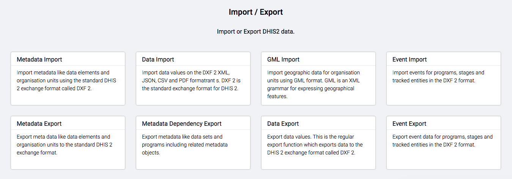
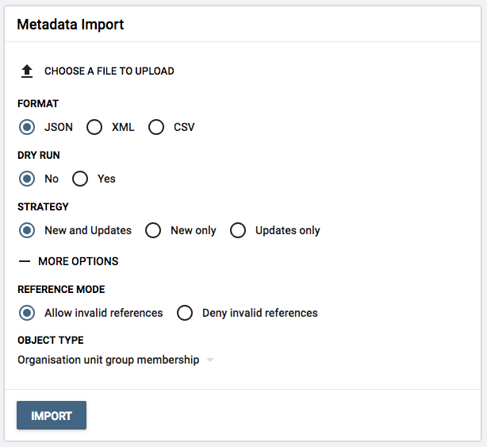
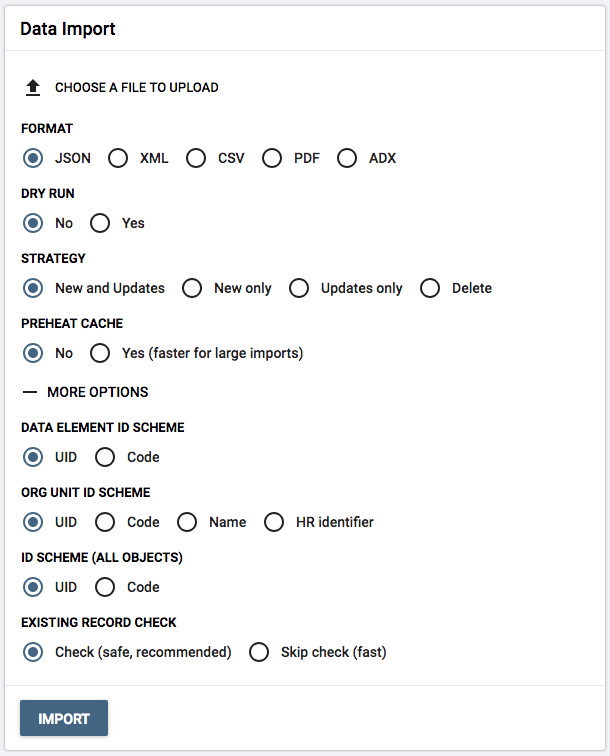
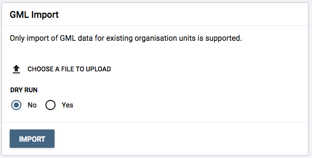
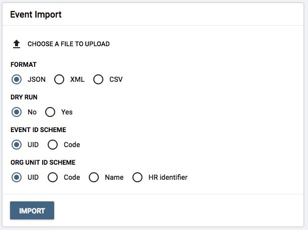
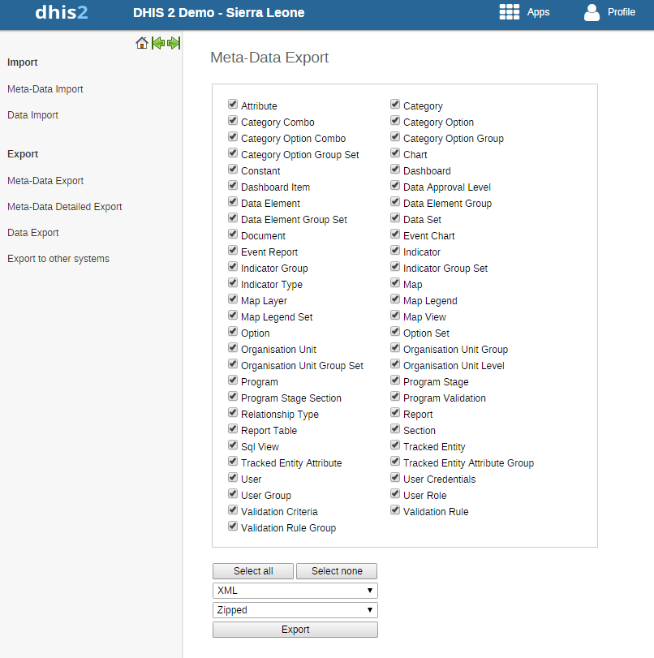
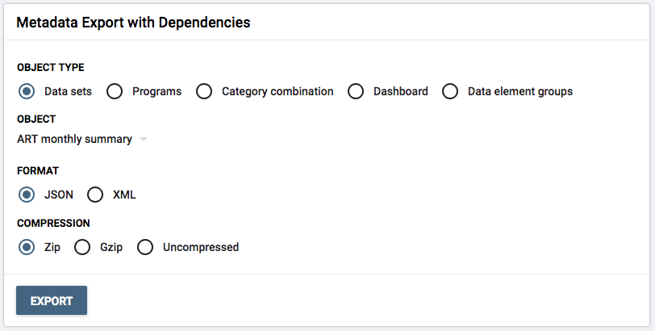
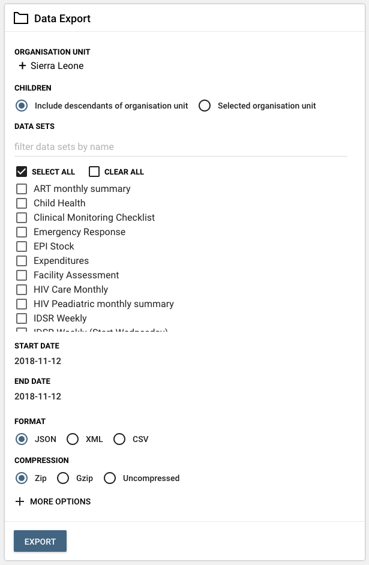
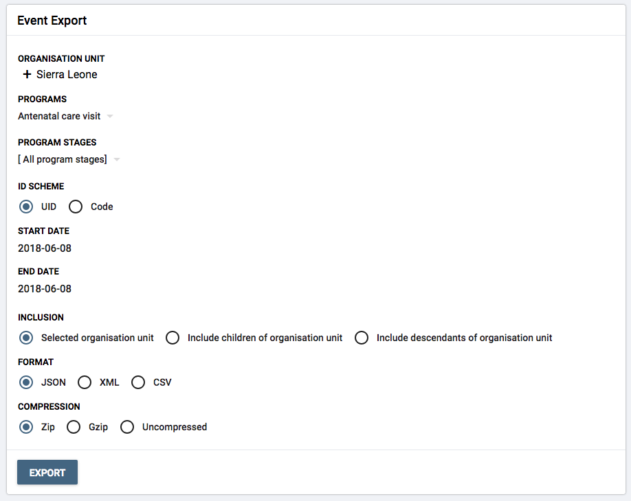

# Import/Export App

<!--DHIS2-SECTION-ID:import_export-->

In a primary health system, the HMIS typically involves a distributed
application, where the same application is running in different
geographical locations (PHCs,CHCs, hospitals, districts, and state).
Most of these physical locations do not have Internet connectivity, and
hence they work off-line. At some point (normally at the district
level), the data needs to be synchronised in order to have a
consolidated database for the a particular geographical region. For
this, it is important to be able to export data from one location (which
is working offline, say at the health facility level) to another one say
at the district level where the data would need to be imported. This
feature of exporting and importing is thus a crucial function of a HMIS.
This feature also helps us overcome the dependency on Internet to some
degree, as data updates can be transferred via USB key where there is no
connectivity, or through email where there is limited Internet
connectivity. DHIS2 provides robust export-import functionality to
fulfill these needs.

To access the Import/Export app, search in the top header bar for
Import/Export. Import/Export app offers a number of services details for
which can be found below.

## Metadata Import

Metadata Import can be accessed from the left sidebar by clicking on
Metadata Import.

1.  Choose a file to upload

2.  Select from the available formats e.g. *JSON* , *XML* or *CSV*

3.  Choose **Dry Run** . *Yes* will do a test import without importing
    any data into the database.

4.  Choose a import strategy from

5.  Click **MORE OPTIONS** if you want to adjust Reference Mode or
    Object Type before importing.

6.  Click **Import** which will bring up the **Logger** at the bottom of
    the page to show the progress.

> **Note**
> 
> **It is highly recommend always using the Dry run option** when
> importing data to make sure you keep control over any changes to your
> Metadata and database being out of sync on data elements or
> organisation unit names

Clicking **Import** will bring up **Logger** at the bottom of the
screen. As import process happens it's log would show up here.

> **Note**
> 
> Note
> 
> If an organisation unit e.g.
> 
> Nduvuibu MCHP
> 
> had a unknown reference to an object with ID
> 
> aaaU6Kr7Gtpidn
> 
> . It means that the object with ID
> 
> aaaU6Kr7Gtpidn
> 
> was not present in your imported file, and it was not found in the
> existing database. You can control this using
> 
> Reference Mode
> 
> option available under
> 
> MORE OPTIONS
> 
> . If you want to allow objects with such references to be imported or
> not. If you choose to import invalid references you will have to fix
> this manually in DHIS2 later, if the reference should have pointed to
> something else.

### Matching identifiers in DXF2

The DXF2 format currently support matching for two identifiers, the
internal DHIS2 identifier (known as a UID), and also using an external
identifier called called a "code". When the importer is trying to search
for references (like the one above), it will first go to the UID field,
and then to the code field. This allows you to import from legacy
systems without having a UID for every meta-data object. I.e. if you are
importing facility data from a legacy system, you can leave out the ID
field completely (DHIS2 will fill this in for you) and the put the
legacy systems own identifiers in the code field, this identifier is
required to be unique. This not only works for organisation units, but
for all kinds of meta-data, allowing for easy import from other systems.

## Data Import

<!--DHIS2-SECTION-ID:import-->

Data Import can be accessed from the left sidebar by clicking on Data
Import.

1.  Choose a file to upload

2.  Select from the available formats e.g. *JSON* , *XML* , *PDF* or
    *ADX*

3.  Select from the available formats e.g. *JSON* , *XML* , *PDF* or
    *ADX*

4.  Choose a import strategy from

5.  Click *MORE OPTIONS* if you want to adjust Data Element ID Scheme,
    Org. Unit ID Scheme, ID Scheme or Existing Record Check before
    importing.

6.  Click *Import* which will bring up the *Logger* at the bottom of the
    page to show the progress.

### PDF data

<!--DHIS2-SECTION-ID:importPDFdata-->

DHIS2 supports import of data in the PDF format. This can be used to
import data produced by off-line PDF data entry forms. Please refer to
the section **Data set management** for details on how to produce a PDF
form which can be used for off-line data entry.

To import a PDF data file, navigate to the *PDF Data Import* item in the
left-side menu. Upload the completed PDF file and click *Import*.

## GML Import

<!--DHIS2-SECTION-ID:gml_import-->

GML Import can be accessed from the left sidebar by clicking on GML
Import.

1.  Upload a file using the *GML* (Geographic Markup Language) format.

2.  Choose **Dry Run** . *Yes* will do a test import without importing
    any data into the database.

3.  Click **Import** which will bring up the **Logger** at the bottom of
    the page to show the progress.

## Event Import

<!--DHIS2-SECTION-ID:event_import-->

Event can be access from the left sidebar by by clicking on Event
import.

1.  Select from the available formats e.g. *JSON* , *XML* or *CSV*

2.  Choose **Dry Run** . *Yes* will do a test import without importing
    any data into the database.

3.  Choose **Event ID Scheme**.

4.  Choose **Org Unit ID Scheme**.

5.  Click **Import** which will bring up the **Logger** at the bottom of
    the page to show the progress.

## Metadata export

<!--DHIS2-SECTION-ID:metadata_export-->

Metadata export can be accessed from the left sidebar by clicking on
Metadata export.

1.  Choose the list of objects you would like to export.

2.  Choose export *format* *JSON* or *XML*

3.  Choose *compression* type *zip* , *gzip* or *uncompressed*

4.  Choose option *Sharing* with or without sharing.

5.  Click **Export** which will bring up the **Logger** at the bottom of
    the page to show the progress.

6.  The exported file is downloaded to your local computer.

## Metadata export with dependencies

<!--DHIS2-SECTION-ID:metadata_export_dependencies-->

Metadata export with dependencies lets you create canned exports for
metadata objects. This type of export will include the metadata objects
and the metadata object's related objects, that is the metadata which
belong together with the main object.

<table>
<caption>Object types and their dependencies</caption>
<colgroup>
<col style="width: 50%" />
<col style="width: 50%" />
</colgroup>
<thead>
<tr class="header">
<th>
Object type
</th>
<th>
Dependencies included in export
</th>
</tr>
</thead>
<tbody>
<tr class="odd">
<td>
<strong>Data sets</strong>

DHIS2_SECTION_ID:docs-internal-guid-4a3662ce-63b9-1efd-e640-8ba874d1bcde:</td>
<td>
Data elements

Sections

Indicators

Indicator types

Attributes

Data entry forms

Legend sets

Legends

Category combinations

Categories

Category options

Category option combinations

Option sets
</td>
</tr>
<tr class="even">
<td>
Programs
</td>
<td>
Data entry form

Tracked entity

Program stages

Program attributes

Program indicators

Program rules

Program rule actions

Program rule variables

Program attributes

Data elements

Category combinations

Categories

Category options

Category option combinations

Option sets
</td>
</tr>
<tr class="odd">
<td>
Category combination
</td>
<td>
Category combinations

Categories

Category options

Category option combinations

Attributes
</td>
</tr>
<tr class="even">
<td>
Dashboard
</td>
<td>
Dashboard items

Charts

Event charts

Pivot tables

Event reports

Maps

Reports

Resources
</td>
</tr>
<tr class="odd">
<td>
Data element groups
</td>
<td>
Data elements

Category combinations

Categories

Category options

Category option combinations

Option sets

Attributes

Legend sets

Legends
</td>
</tr>
</tbody>
</table>

1.  Select an **Object type** : **Data sets** , **Programs** ,
    **Category combination** , **Dashboard** or **Data element group**.

2.  Select an **Object**.

3.  Select a format: **XML** or **JSON**.

4.  Select **Compression** : **Zip** , **Gzip** or **Uncompressed**.

5.  Click **Export** which will bring up the **Logger** at the bottom of
    the page to show the progress.

6.  The exported file is downloaded to your local computer.

## Data export

Data export can be accessed from the left sidebar by clicking on Data
export.

1.  Select the *Organisation Units* .

2.  Set the *Start* and *End Date* .

3.  Choose the *Data Sets*

4.  Select a format: **XML** or **JSON** .

5.  Select **Compression** : **Zip** , **Gzip** or **Uncompressed**.

6.  Click *MORE OPTIONS* If you want to adjust Data Element ID Scheme,
    Org. Unit ID Scheme or Category ID Scheme before export.

7.  Click **Export** which will bring up the **Logger** at the bottom of
    the page to show the progress.

8.  The exported file is downloaded to your local computer.

## Event export

Event export can be accessed from the left sidebar by clicking on Event
export.

You can export event or tracker data in **XML** , **JSON** or **CSV**
formats.

1.  Select an organisation unit.

2.  Select a program and a program stage (if applicable).

3.  Select the **ID scheme** to use for export: **UID** (default) or
    **CODE** .
    
    If you select **CODE** but the object's attribute does not have
    code, it will not be included in the return payload.

4.  Select **Start date** and **End date** .

5.  Select the **Inclusion**:
    
      - **Selected organisation unit** : Export event data only for the
        selected organisation unit
    
      - **Include children of organisation unit** : Export event data
        for the children of the organisation unit as well as the
        selected organisation unit itself.
    
      - **Include descendants of organisation unit** : Export event data
        for the descendants of the organisation unit as well as the
        selected organisation unit itself.

6.  Select a format: **XML** , **JSON** or **CSV**.

7.  Select **Compression** : **Zip** , **Gzip** or **Uncompressed**.

8.  Click **Export** which will bring up the **Logger** at the bottom of
    the page to show the progress.

9.  The exported file is downloaded to your local computer.

