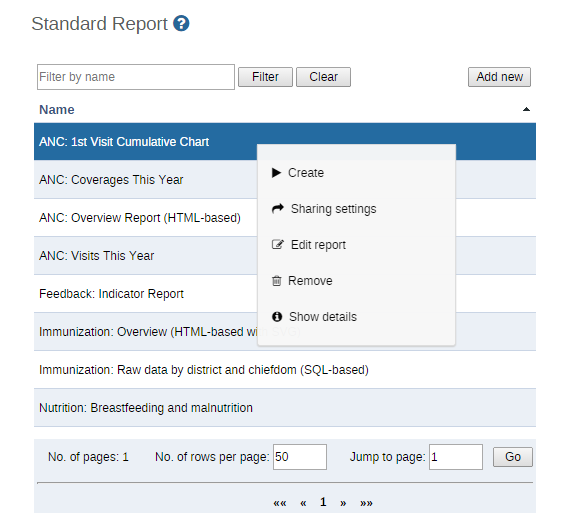
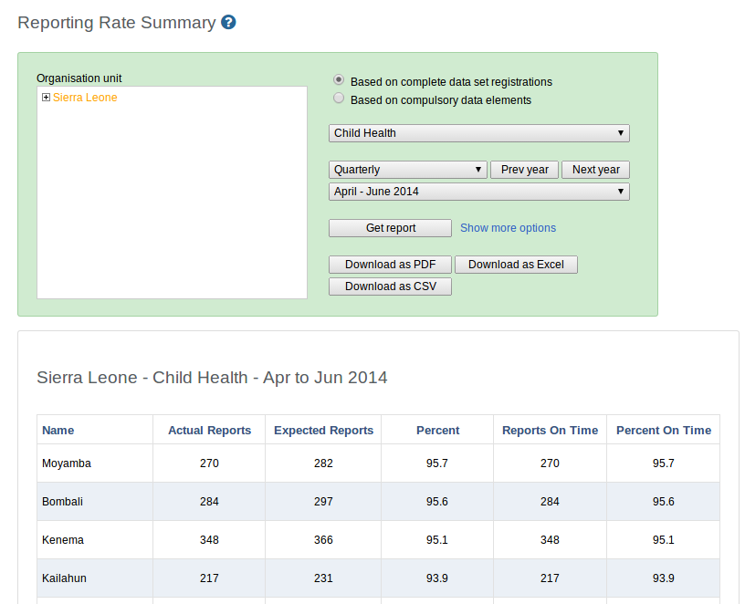
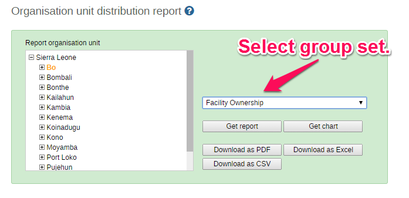

# Using reporting functionality

<!--DHIS2-SECTION-ID:using_reporting-->

## Reporting functionality in DHIS2

<!--DHIS2-SECTION-ID:using_reporting_intro-->

The reporting module in DHIS2 provides a range of reporting
alternatives, and this section will explain how to use them to view and
analyse data. Another section explains how to configure and set up the
various reporting tools.

**Standard reports:** Standard reports are built on pivot tables, but
are more advanced in its design allowing for more cosmetics and styles.
These reports can also combine multiple tables and charts in the same
report and be made available as one-click reports that are very easy to
use. These reports can be downloaded as PDF files which makes them ideal
for printing as well as sharing offline.

**Dataset reports:** Dataset reports are simply a printer friendly way
to look at the data entry forms with either raw or aggregated data (over
time or place). The design used in data entry will be used also in the
data set reports. This will work only for data sets that has a custom
data entry form set up.

**Dashboard:** The fastest way to view your data. The dashboard can
display up to four updated charts as well as shortcuts to your favourite
reports, report tables, and map views. Each user can configure a
personal dashboard.

**Data Visualizer:** Do flexible visualizations of your data as charts
and data tables. Any number of indicators and data elements can be
included. Several chart types are available, such as column, stacked
column, line, area and pie charts. The charts can be saved in order to
be easily retrieved later and can also be put on your personal
dashboard. Charts can be downloaded as image and PDF files to your local
computer.

**Orgunit distribution reports:** These reports are generated off the
orgunit group set information and can show what types (and how many of
each type) of health facilities that are located in a given area (any
level in the hierarchy). These reports are automatically generated and
display the information in both tables and charts, and downloads in PDF,
excel, and CSV are available.

**Reporting rate summary:** These reports provide a nice overview of how
many facilities that have submitted their data for a given dataset and
period. Here you can get both the counts and the percentages showing the
reporting rate for all or single data sets.

**Web-based pivot tables:** The built in pivot table tool is a web-based
tool to display indicator data by orgunit and period in a typical pivot
table view and allows for pivoting manipulations of the tables. It
allows for large amounts of data to be downloaded offline for analysis
as well.

**GIS:** Present and analyse your data using thematic maps. You can view
both data elements and indicators and given that you have coordinates
for all your orgunits you can drill down the hierarchy and view maps for
all levels from country polygons to facility points. See the separate
chapter on GIS for more details. All the map information is built into
DHIS2 and all you need to do is to register coordinates for your
organisation units and the maps will be available.

## Using standard reports

<!--DHIS2-SECTION-ID:using_reporting_standard_reports-->

You access the available reports by navigating to Apps-\>Reports. In the
report menu in the left bar, click Standard Report. A list of all
pre-defined reports will appear in the main window.

You run/view a report by clicking on the name of the report and then
selecting "Create" from the contextual menu. If there are any
pre-defined paramaters, you will see a report parameter window where you
must fill in the values needed for orgunit and/or reporting month,
depending on what has been defined in the underlying report table(s).
Click on "Get Report" when you are ready. The report will either appear
directly in your browser or be available as a PDF file for download,
depending on your browser settings for handling PDF files. You can save
the file and keep it locally on your computer for later use.

## Using dataset reports

<!--DHIS2-SECTION-ID:using_reporting_dataset_reports-->

Dataset reports are printer friendly views of the data entry screen
filled with either raw or aggregated data. These are only available for
data sets that have custom data entry forms and not for default or
section forms.

You can access data set reports from Apps-\>Reports.

A Criteria window will appear where you fill in the details for your
report:

**Dataset:** The data set you want to display.

**Reporting period:**The actual period you want data for. This can be
aggregated as well as raw periods. This means that you can ask for a
quarterly or annual report even though the data set is collected
monthly. A data set's period type (collection frequency) is defined in
data set maintenance. First select the period type (Monthly, Quarterly,
Yearly etc.) in the drop down next to Prev and Next buttons, and then
select one of the available periods from the dropdown list below. Use
Prev and Next to jump one year back or forward.

**Use data for selected unit only:** Use this option if you want a
report for an orgunit that has children, but only want the data
collected directly for this unit and not the data collected by its
children. If you want a typical aggregated report for an orgunit you do
not want to tick this option.

**Reporting Organisation unit:** Here you select the orgunit you want
the report for. This can be at any level in the hierarchy as the data
will be aggregated up to this level automatically (if you do not tick
the option above).

When you are done filling in the report criteria you click on
"Generate". The report will appear as HTML in a printer-friendly format.
Use the print and save as functions in the browser to print or save (as
HTML) the report.You can also export the data set report in Excel and
PDF formats.

## Using resources

<!--DHIS2-SECTION-ID:using_reporting_resources-->

The resource tool allows you to upload both files from your local
computer to the DHIS server and to add links to other resources on the
Internet through URLs. If cloud storage is configured for your system,
resources will be saved there.

To create a new resource:

1.  Open the **Reports** app and click **Resource**.

2.  Click **Add new**.

3.  Enter a **Name**.

4.  Select a **Type**: **Upload file** or **External URL**.

5.  Click **Save**.

## Using reporting rate summary

<!--DHIS2-SECTION-ID:using_reporting_reporting_rate_summary-->

Access the reporting rate summary from the Apps-\>Reports menu.
Reporting rate summaries will show how many datasets (forms) that have
been submitted by organisation unit and period. There are two methods
available to calculate reporting rates (completeness):

  - Based on complete data set registrations. A complete data set
    registration refers to a user marking a data entry form as complete,
    typically by clicking the complete button in the data entry screen,
    hereby indicating to the system that she considers the form to be
    complete. This is i.e. a subjective approach to calculating
    completeness.

  - Based on compulsory data element: You can define any number of data
    elements in a data set to be compulsory. This implies that data
    values must be captured for all data elements which have been marked
    as compulsory in order for the data set to be considered complete.
    This is i.e. an objective approach to calculating completeness.

The reporting rate summary will for each row show a range of measures:

  - Actual reports: Indicates the number of data entry complete
    registrations for the relevant data set.

  - Expected reports: Indicates how many data entry complete
    registrations are expected. This number is based on the number of
    organisation units the relevant data set has been assigned to
    (enabled for data entry).

  - Percent: The percentage of reports registered as complete based on
    the number expected.

  - Reports on time: Same as actual reports, only reports registered as
    complete within the maximum number of days after the end of the
    reporting period. This number of days after reporting period can be
    defined per data set in the data set management.

  - Percent on time: Same as percentage, only reports registered as
    complete on time used as numerator.

To run the report you can follow these steps:

  - Select an orgunit from the tree.

  - Select one of the completeness methods to use to calculate the
    reporting rates.
    
    Select all or one data set. All will give you a report with all data
    sets for the selected organisation unit. A single data set will give
    you a report with completeness for all children of the selected
    organisation unit.

  - Select a period type and a period from the list of available periods
    for that period type. Move back/forward one year by using the
    prev/next buttons.

  - The report will then be rendered. Change any of the parameters above
    and the report will be updated automatically.

## Using organisation unit distribution reports

<!--DHIS2-SECTION-ID:using_reporting_orgunit_distribution_reports-->

You can access the Orgunit Distribution reports from the left side menu
in the Apps-\>Reports.

Orgunit distribution reports are reports that show how the orgunits are
distributed on various properties like type and ownership, and by
geographical areas.

The result can be presented in a table-based report or in a chart.

**Running a report:**

To run a report first select an orgunit in the upper left side orgunit
tree. The report will be based on orgunits located under the selected
orgunit. The select the orgunit group set that you want to use,
typically these are Type, Ownership, Rural/Urban, but can be any
user-defined orgunit group set. The you can click on either Get Report
to get the table-based presentation or Get chart to get the same result
in a chart. You can also download other format such as PDF, Excel and
CSV.

## Generate analytics tables

<!--DHIS2-SECTION-ID:generate_analytics_tables-->

DHIS2 generates database tables which the system then uses as basis for
various analytics functions. These tables are also valuable if you write
advanced SQL reports. In the **Data Administration** app, you can execute the tables 
generation immediately. If you want to schedule them to be executed at regular intervals, 
this can be done in the **Scheduler** app. This means that you can refresh recent analytics on 
demand and see updated pivot tables without waiting for all of the past years data to
re-process.

> **Note**
> 
> You can also generate the tables through the web API. This task is
> typically performed by a system administrator.

1.  Open the **Data Administration** app and click **Analytics Tables**.

2.  Select the parts of the analytics process you want to skip:
    
      - **Skip generation of resource tables**
    
      - **Skip generation of aggregate data and completeness data**
    
      - **Skip generation of event data**
    
      - **Skip generation of enrollment data**

3.  Select **Number of last years of data to include**.

4.  Click **Start export**.

