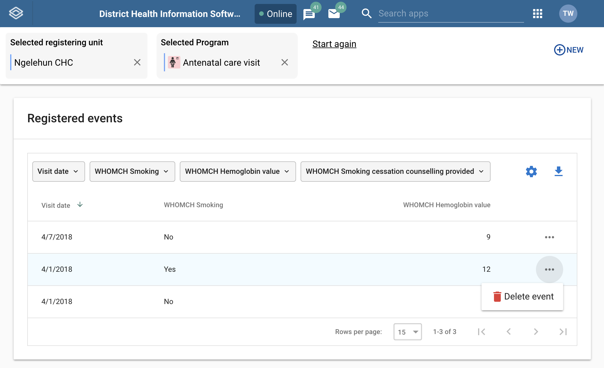
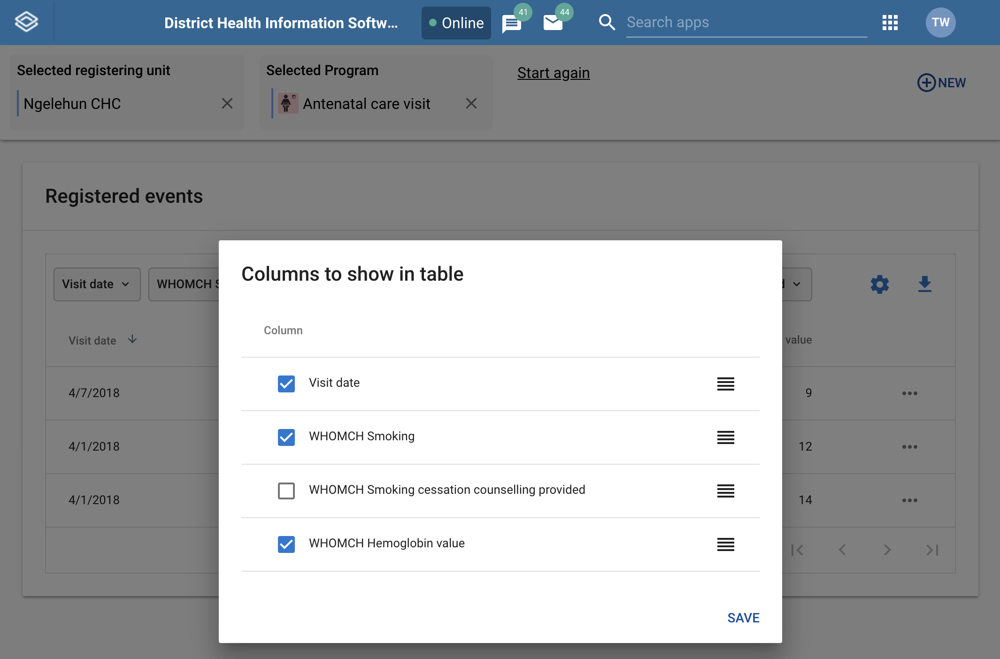
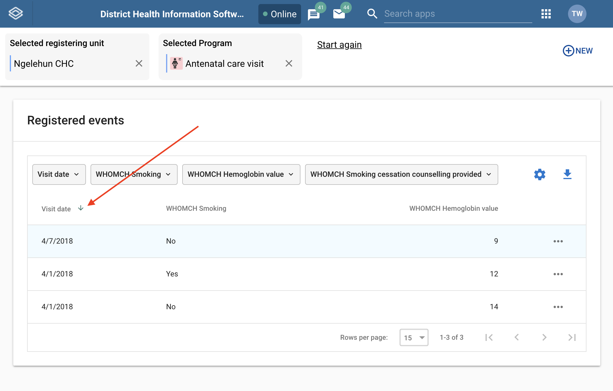
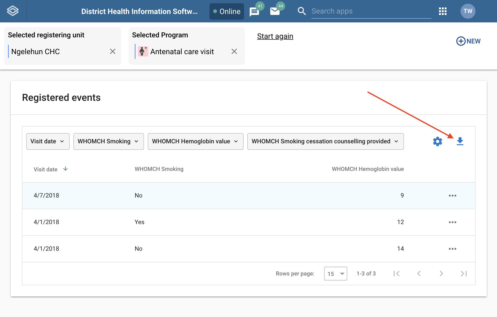

# Using the Capture app

<!--DHIS2-SECTION-ID:capture_app-->

## Register an event

<!--DHIS2-SECTION-ID:capture_register_event-->

1.  Open the **Capture** app.

2.  Select an organisation unit.

3.  Select a program.
    
    You'll only see programs associated with the selected organisation
    unit and programs you've access to.

4. If the program has a category combination set the category combination option will have to be selected.

5.  Click **New**.

6.  Fill in the required information.
    
    If the programs program stage is configured to capture a location:
    
      - If the field is a coordinate field you can either enter the coordinates
      directly or you can click the **map** icon to the left of the coordinate field.
      The latter one will open a map where you can search for a location or set on
      directly by clicking on the map.
    
      - If the field is a polygon field you can click the **map** icon to the left of
      the field. This will open a map where you can search for a location and capture
      a polygon (button in the upper rigth corner of the map).

7. If desired you can add a comment by clicking the **Write comment** button at he bottom of the form.

8.  Click **Save and exit** or click the arrow next to the button to select **Save and add another**.
    - **Save and add another** will save the current event and clear the form.
    All the events that you have captured will be diplayed in a list at the bottom of the page.
    When you want to finish capturing events you can, if the form is blank,
    click the finish button or if your form contains data click the arrow
    next to **Save and add another** and select **Save and exit**.

> Note: The data entry form can also be diaplayed in **row view**. In this mode the data elements are arranged horizontally. This can be achived by clicking the **Switch to row view** button on the top right of the data entry form. If you are currently in **row view** you can switch to the default form view by clicking the **Switch to form view** button on the top right of the data entry form.

## Edit an event

<!--DHIS2-SECTION-ID:capture_edit_event-->

1.  Open the **Capture** app.

2.  Select an organisation unit.

3.  Select a program.
    
    All events registered to the selected program show up in a list.

4.  Click the event you want to modify.

5.  Modify the event details and click **Save**.

## Delete an event

<!--DHIS2-SECTION-ID:capture_delete_event-->

1.  Open the **Capture** app.

2.  Select an organisation unit.

3.  Select a program.
    
    All events registered to the selected program show up in a list.

4.  Click the **tripple dot** icon on the event you want to delete.

5.  In the menu that is displayed click **Delete event**.

## Modify an event lists layout

<!--DHIS2-SECTION-ID:capture_modify_event_list_layout-->

You can select which columns to show or hide in an event list. This can
be useful for example when you have a long list of data elements
assigned to a program stage.

1.  Open the **Capture** app.

2.  Select an organisation unit.

3.  Select a program.
    
    All events registered to the selected program show up in a list.

4.  Click the **gear** icon on the top right of the event list.

5.  Select the columns you want to display and click **Save**.

> Note: You can reorganize the order of the data elements by draging and dropping them in the list.

## Filter an evnet list

<!--DHIS2-SECTION-ID:capture_filter_event_list-->

1.  Open the **Capture** app.

2.  Select an organisation unit.

3.  Select a program.
    
    All events registered to the selected program show up in a list.

    Along the top of the event list are button with the same names as the column headers in the list.

4.  Use the buttons on the top of the list to filter based on a report date or a spesific data element.

> Note: Data elements will have slightly diffrent way that they are filtered. A **Number** data element will for instance show a rang to filter on while a **Text** data element will ask you to enter a search query to filter on.

## Sort an evnet list

<!--DHIS2-SECTION-ID:capture_sort_event_list-->

1.  Open the **Capture** app.

2.  Select an organisation unit.

3.  Select a program.
    
    All events registered to the selected program show up in a list.

4.  Click one of the column headers to sort the list on that data element in ascending order.

    A small upward arrow is displayed next to the column to show that the list is sorted in ascending order.

5.  Click the column header again to sort the list on that data element in descending order.

     A small downward arrow is displayed next to the column to show that the list is sorted in descending order.

 
## Download an event list

<!--DHIS2-SECTION-ID:capture_download_event_list-->

1.  Open the **Capture** app.

2.  Select an organisation unit.

3.  Select a program.
    
    All events registered to the selected program show up in a list.

4.  Click the **downward arrow** icon on the top right of the event list.

5.  Select the format you want to download.

> Note: You can download an event list in JSON, XML or CSV formats.