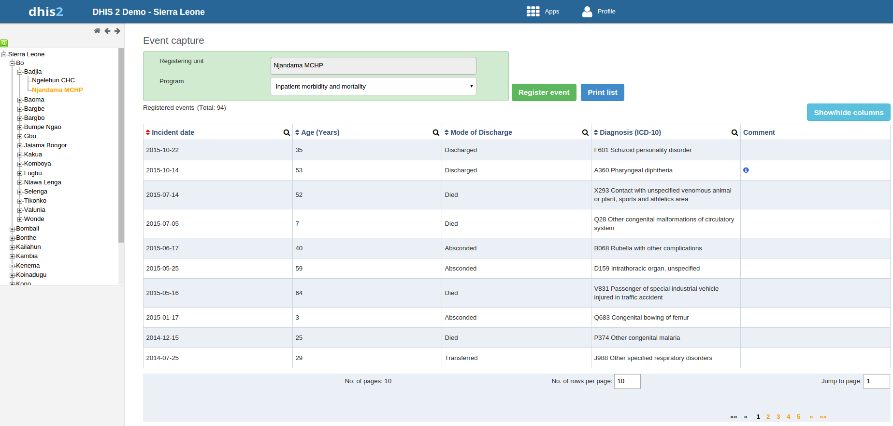
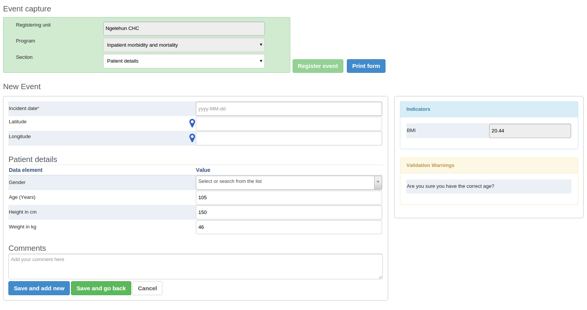

# Using the Event Capture app

<!--DHIS2-SECTION-ID:event_capture_app-->

## About the Event Capture app

<!--DHIS2-SECTION-ID:about_event_capture_app-->

In the **Event Capture** app you register events that occurred at a
particular time and place. An event can happen at any given point in
time. This stands in contrast to routine data, which can be captured for
predefined, regular intervals. Events are sometimes called cases or
records. In DHIS2, events are linked to a program. The **Event Capture**
app lets you select the organisation unit and program and specify a date
when a event happened, before entering information for the event.

The **Event Capture** app works online and offline. If the Internet
connectivity drops, you can continue to capture events. The events will
be stored locally in your web browser (client). When connectivity has
returned, the system will ask you to upload the locally stored data. The
system then sends the data to the server where the data is stored.

> **Note**
> 
> If you close the web browser while in offline mode, it is not possible
> to reopen a new web browser window and continue the working session.
> However the data will still be saved locally and can be uploaded to
> the server the next time the machine is online and the you have logged
> into the server.

  - You only see programs associated with the organisation unit you've
    selected and programs you've access to view through your user role.

  - Both skip-logic and validation error/warning messages are supported
    during registration.

  - When you close an organisation unit, you can't register or edit
    events to this organisation unit in the **Event Capture** app. You
    can still view and filter the event list and view the details of an
    event.

  - On-the-fly indicator expression evaluation is supported. If a
    program has indicators defined for it and the moment all values
    related to the indicator expression are filled, the system will
    calculate indicator and display the result.
    
    

  - **Sorting:** this can be done by clicking the sorting icon of each
    column header. A red sorting icon implies the current sorting
    column. However, the sorting functionality works only within the
    page displayed. Currently, it is not possible to do sorting from
    serverside.

  - **Filtering:** this is done by clicking the small search icon shown
    to the right of each column header. Clicking them provides an input
    field to type a filtering criteria. The system starts applying the
    filter the moment a user starts to type. During filtering it is
    possible to define start and end dates for date type data elements
    and lower and upper limits for number types. Server side filtering
    is not-support at the moment.

## Register an event

<!--DHIS2-SECTION-ID:event_capture_register_event-->

1.  Open the **Event Capture** app.

2.  Select an organisation unit.

3.  Select a program.
    
    You'll only see programs associated with the selected organisation
    unit and programs you've access to through your user role.

4.  Click **Register event**.

5.  Select a date.

6.  Fill in the required information.
    
    If the program's program stage is configured to capture GPS
    coordinate, you can enter the coordinates in two ways:
    
      - Enter values directly in corresponding fields.
    
      - Choose a location in a map. The map option also displays
        polygons and points that are defined for organisation units.

7.  Click **Save and add new** or **Save and go back**.

## Edit an event

<!--DHIS2-SECTION-ID:event_capture_edit_event-->

1.  Open the **Event Capture** app.

2.  Select an organisation unit.

3.  Select a program.
    
    All events registered to the selected program show up in a list.

4.  Click the event you want to modify and select **Edit**.

5.  Modify the event details and click **Update**.

## Edit events in grid

<!--DHIS2-SECTION-ID:event_capture_edit_event_grid-->

The **Edit in grid** function allows you to edit a selected event within
the table but only those columns (data elements) visible in the grid. If
you need more columns, use **Show/hide columns** to specify which
columns should be displayed in the list.

1.  Open the **Event Capture** app.

2.  Select an organisation unit.

3.  Select a program.
    
    All events registered to the selected program show up in a list.

4.  Click the event you want to modify and select **Edit in grid**.

5.  Modify the event details.

6.  Click on another event to close the edit mode.

## Share events in edit mode

<!--DHIS2-SECTION-ID:event_capture_share_event_edit_mode-->

You can share an event in edit mode via its web address.

1.  Open the **Event Capture** app.

2.  Open the event you want to share in edit mode.

3.  Copy the URL.
    
    Make sure that the URL contains "event" and "ou" (organisation unit)
    parameters.

4.  Paste the URL in the sharing method of your choice, for example an
    e-mail or a message within DHIS2.
    
    If you're not logged in to DHIS2 when you click the link, you'll be
    asked to do so and then taken to the dashboard.

## View an event audit history

<!--DHIS2-SECTION-ID:event_capture_view_event_audit_history-->

1.  Open the **Event Capture** app.

2.  Select an organisation unit.

3.  Select a program.
    
    All events registered to the selected program show up in a list.

4.  Click an event and select **Audit history**.

## Delete an event

<!--DHIS2-SECTION-ID:event_capture_delete_event-->

1.  Open the **Event Capture** app.

2.  Select an organisation unit.

3.  Select a program.
    
    All events registered to the selected program show up in a list.

4.  Click an event and select **Remove**.

5.  Click **Remove** to cocnfirm the deletion.

## Modify an event list's layout

<!--DHIS2-SECTION-ID:event_capture_modify_event_list_layout-->

You can select which columns to show or hide in an event list. This can
be useful for example when you have a long list of data elements
assigned to a program stage. Once you've modified the layout, it's saved
on your user profile. You can have different layouts for different
programs.

1.  Open the **Event Capture** app.

2.  Select an organisation unit.

3.  Select a program.
    
    All events registered to the selected program show up in a list.

4.  Click the **Show/hide columns** icon.

5.  Select the columns you want to display and click **Close**.

## Print an event list

<!--DHIS2-SECTION-ID:event_capture_print_event_list-->

1.  Open the **Event Capture** app.

2.  Select an organisation unit.

3.  Select a program.
    
    All events registered to the selected program show up in a list.

4.  Click **Print list**.

## Download an event list

<!--DHIS2-SECTION-ID:event_capture_download_event_list-->

1.  Open the **Event Capture** app.

2.  Select an organisation unit.

3.  Select a program.
    
    All events registered to the selected program show up in a list.

4.  Click the **Downlad** icon and select a format.
    
    You can download an event list in XML, JSON or CSV formats.

